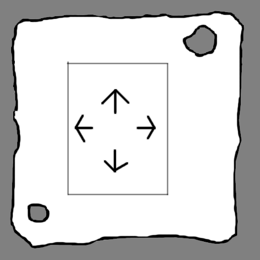
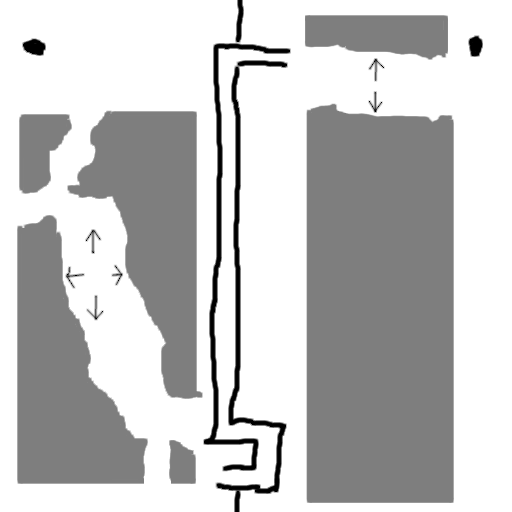

Future Research Directions for Punch Out Model Synthesis
===

Some untested ideas about future work for POMS.


Tile Group Stamping (engineering)
---

As an artifact from the tile constraint generation process,
many tiles have only one or just a few neighbors and are
part of a larger structure.

For example, the Kenney "Marble" tile set.
One attempt at creating a tile set that could be fed into POMS
subdivided the tiles into smaller (non uniform) cuboids
with each smaller cuboid being its own tile value.

This inflated the tile count, which had the double drawback
of requiring more memory for equivalent grid sizes and
also slowed down AC4 as AC4 grows as some polynomial in terms
of domain size.

To mitigate the speed, at least, one can potentially "stamp out"
the collection of POMS tiles derived from the source tile,
including some portion of the AC4 counts, as much of the rest
of the structure is completely determined as soon as one tile is
chosen.
This should save AC4 from doing a lot of work because it's
not decrementing AC4 counts from tiles that will eventually be removed,
and can just remove them wholesale.

There's still some details to be worked out but I suspect this
can be done and can give orders of magnitude speedup on a variety
of tile sets.
This might even make tiered bit packing feasible.


Automated Biome Selection via Spectral Clustering (theoretical)
---

The idea:

* Take the tile constraints and create an implied adjacency matrix
  - Though not clear what method is "best", one simple method
    is to create a vertex for every tile and connect two tiles
    together if they share a tile constraint in any direction
* Run the matrix through a spectral clustering algorithm
* Use the resulting labels to infer tile groupings (i.e. "biomes")

The idea is that there's a lot of information encoded in the implied
tile constraint graph, however it's interpreted, which can then be used
to find groupings of tiles.
For example, for the OARPGO tile set, water tiles will tend to cluster with
water tiles, green forest tiles will tend to cluster with other green forest
tiles, etc.

In principle, the resulting grouped tiles can then be weighted by regions to prefer one
biome or another.
It's not clear (to me) how to guess the biome count (maybe some relative
eigenvalue size, some eigenvalue cutoff, etc?) but if you make a best effort
guess, you can then use it to differentiate individual tiles into groupings/biomes.

The spectral clustering itself is very nearly a "one-liner" in Python:

```
A = []
N = len(poms_data["weight"])
for r in range(N):
  A.append([])
  for c in range(N):
    A[r].append(0)

for rule in poms_data["rule"]:
  src_tile = rule[0]
  dst_tile = rule[1]
  idir = rule[2]
  val = rule[3]
  if (val < 0.5): continue

  A[src_tile][dst_tile] = 1
  A[dst_tile][src_tile] = 1

model = skl_cluster.SpectralClustering(n_clusters=N_CLUSTER, affinity='precomputed', assign_labels='cluster_qr')
labels = model.fit_predict(A)
```

Fiddling with individual tile probabilities is notoriously finicky, so there's some work
to do to figure out how to actually use the information effectively.

Investigate Stuttering and Find Strategies to Mitigate It
---

There's a "stuttering" effect that happens with many of the tile sets, especially
ones that have large numbers of tiles.
As mentioned in the paper, this effect is most likely because of the Markovian property
of the local solver and it gets into a potentially re-enforcing feedback loop where
when choosing which subset of tiles to choose.

Thinking out loud, this might have to do with the lower order eigenvalues of the implied
adjacency rule constraint matrix being close to the principle eigenvalue, but this would
need to be investigated.

Regardless, the first task is to try and understand why it's happening, at least heuristically.
The second is to try and find strategies for mitigation.

Things that come to mind:

* weight tiles randomly
* weight tiles via some Perlin noise, maybe in tile groups with the above spectral clustering
  method
* use the second (third, fourth, etc.) eigenvalue information to inform choice, if this is
  useful intuition in the first place

Multi-Scale Tile Hinting
---

This idea is still nascent but I wanted a record of it for future reference.

There's the low level tile rules that are hard constraints.
The inferred rules, from an exemplar image, say, are highly localized
and so suffer from myopia that includes things like stuttering, inability
to discern global contraints, difficulty in creating global patterns, etc.

To try and allow for longer range effects, we can try to do the following:

* Consider a sequence of increasing block regions (2x2, 3x3, etc.)
* The block regions can be thought of as "bag of tiles" and represented
  by a frequency of tiles appearing in the block region
* We can try to partition these bag of tiles into groups through some clustering
  method or some lower dimensional embedding method
* From these partitioned groups, we can infer neighbor placement probabilities
  on a group level
* From the group neighbor placement probabilities, we can overlay a probability
  on the underlying small scale grid

The details are probably difficult to work out but I think this is possible.

At larger scales, the "bag of tiles" (BoT) approach assumes the details
don't matter in lieu of describing the region by the tile frequency.
We leave the small scale details of how to realize the region to the constraint
solver.

A note: spectral clustering assumed a graph with structure where we want
to partition the nodes in the graph.
Standard k-means might be more appropriate for BoT as now we have a potentially
large data point set from sliding a window and creating tile frequency vectors.

Thinking out loud:

* BoT with a window size of the initial exemplar image will create global tile
  frequencies
* There might be "characteristic" features for certain BoT window sizes
  - think of forest micro, the rivers might have a characteristic size that
    will yield a rule set for quantized BoT groupings that alternate between
    river-like BoT vectors and land BoT vectors

This has a chance of picking up global features and guiding globally constrained systems.

Give a BoT at a certain window size or scale, the basic idea is to overlay a probability
onto the underlying individual tile probabilities.
This means the $G$ function (individual tile probability) can be overloaded to take this
modified probability.

The probability should be clamped to some non zero minimum so that we allow for forced
tiles.

The question of how to properly weight the probabilities implied by the different
BoT scales isn't obvious to me so will need some experimentation.

In my opinion, here are the critical observations:

* At larger scales, taking summary information in the form of BoT for some variety of
  window sizes has a hope of working because because the frequency of tiles for a given
  region gives us a sort of certificate that there is a valid realization and the realization
  can be worked out from our low level fine grained hard constraint solver
* The summary information for the BoT vectors can be quantized, giving us probabilistic/continuous
  neighbor constraints at longer scale ranges

The detail to work out is how to use the BoT neighbor information.
These aren't hard constraints anymore so AC3/AC4 can't be used to knockout tiles.

During constraint solving, a region's BoT vector can be calculated by summing
a weighting each tile in each cell by the number tiles in the cell, divided by the total
number of cells.
Choose some similarity to the BoT quantized vectors, using dot product as a default.

Take an example of forst micro at some scale with two quantized BoT elements representing
"river" (R) and "land" (L) meta-tiles.

Roughly, say the following:

|   | 0 (+x) | 1 (-x) | 2 (+y) | 3 (-y) |
|---|--------|--------|--------|--------|
| R | L:0.95, R:0.05 | L:0.9, R:0.1 | L:0.1, R:0.9 | L0.1, R: 0.9 |
| L | L:0.9, R:0.1 | L:0.95, R:0.05 | L:0.9, R:0.1 | L0.9, R: 0.1 |

So river alternates to land, mostly, from left to right but wants to keep river
and land tiles in columns.

So now we have an implied graph created by choosing nodes from the scale window size
whose values can be one of the quantized values along with probabilities
for pair of the values.
If we naively take uniform values for quantized values, we are now in a position
to use something like belief propagation (BP) to find maximum a posteriori (MAP)
assignments.

Some things to consider:

* How we create the rescaled image might have artifacts, so we might want to
  run two models at the same time with one at half pitch and try to interpolate between
  them
* If BP is used, it's slow, so maybe only recalculate every so many iterations
* One can see how path finding might work
* You can bootstrap by considering ever larger instances and recalculating
  the quantized values at different scales


Kintsugi Method (theoretical)
---

###### 2024-10-03

This is very speculative so it needs to be validated.

### The Problem

A toy setup to highlight the problem:

* Take a tile set with only paths and a start/end cap
* Remove start/end cap from the rest of the grid except at opposite corners
* Keep all the rest of the tiles indeterminate to start
* A path is now forced that starts/ends at either corner

If the grid is small enough, this will find an answer.
As the grid grows, the chance of finding a solution in reasonable
time, or at all, becomes small.

The paths from either endcap go through a random (self avoiding) walk.
Small grids, the path has a good chance of just randomly joining together.
As the grid gets bigger, the chance that the two random walks collide (in
reasonable time) gets more difficult.

This problem is
hard because of the limitations of the algorithm, not the problem itself.
For more complicated tile sets, there might be subtle constraints
that aren't obvious or require deep knowledge to figure out how to
find solutions.
We'd like a solution that works for a wide variety of these "silly"
problems.

### Warmup

Take the Forest Micro tile set.

Let's say we want to find a solution for a large grid of size $N \times N$.
If $N$ is large enough, both POMS with just the random block choice scheduler and
BMS with the minimum entropy cell choice heuristic (maximum entropy heuristic)
have major difficulties.

So, come up with a schedule of $K$ sizes, $N _ 0 < N _ 1 < N _ 2 < \cdots < N _ {K-1} < N$.
Start with the $N _ 0 \times N _ 0$ grid and find a solution.
If $N _ 0$ is small enough, this should be likely.

Once a solution has been found for $N _ 0$, break the solution apart from the middle, horizontally
and vertically, and fill in the middle section (in the shape of a "plus") with indeterminate
cells to create a new grid of size $N _ 1 \times N _ 1$.

Once a solution has been found for $N _ 1 \times N _ 1$, repeat until $N \times N$ is reached.

The difference between sizes needs to be large enough to not run into contradictions from
the boundary of the break but small enough so that solutions can still be found.
For example, with the Forest Micro tile set, 10-20 might do just fine.

There's some choice in where to put the break but the middle seemed natural enough.
One could do it on the side but, with Forest Micro in particular, there might be
boundary restrictions, which might make it more difficult than it needs to be
or might bias it in weird ways.

This only works for highly homogeneous grids and any other constraints might
cause issues with this algorithm.
For example, say there's a restriction in the middle of the grid.
Does that go in the initial realization or the last one?
What if the restrictions are non trivial.

Anyway, this particular method is very brittle but last time I tested
it with Forest Micro it worked.

### Discussion

The warmup above works by exploiting a type of symmetry.
The middle region of the grid is homogeneous so we can kind of waive
our hands and have some reasonable expectation of finding a realization
as we inflate the model.

Another way to see this is if there are corners marked out on the large $N \times N$
grid with "teleporters" to the other corner regions.

So one method is to mark of regions that are too complex, the boundary edges of the grid
and maybe the start and end cap of the path, with a large middle homogeneous region.
The large middle homogeneous region can then be considered in isolation, effectively,
with wild card edges as it's boundary conditions.

So do the 'warmup' method for the middle region, starting from a small square, then
breaking and expanding until it hits some non identical region, leaving the middle
indeterminate cross region later for processing.



Doing this expansion for homogeneous regions sidesteps the issue
of having a 'teleport' matching for regions and, presumably, even
can be done in isolation, putting the region back in when its finished
and the boundary conditions match up.

So the break line/cross can even be chosen with some more variability,
and maybe a seam can be chosen with some cost function informed by
the ambient or edge 'constraidedness' factor.

Calculating a cost heuristic to carve a seam might be difficult and finicky.
Instead, you can just do it randomly, trying to randomly grow the rectangular cuboid
and seeing if it gets stitched up.

For example:



One possible drawback is the unbounded nature of how the region gets break/joined,
as there could be a long corridor across the whole map.
This might be a benefit, as long range global constraints might be captured by
this operation, but it's something to look out for.

---

Here the parameters would be the minimum homogeneous region to start this process,
how much we increment the region each step and a randomness parameter to adjust
how aggressive we are at picking breaks horizontally or vertically away from center.
Another parameter might be picked to prefer horizontal or vertical splits.
One could save homogeneous regions and use that in backtracking.

We'd need some canonical examples to test out the method:

* generic Forest Micro tile set
* 3d path with endpoints at opposite corners
* joined path with restricted barrier (as in example above)
* 2+ paths with left endpoint for each through a barrier
  to a permuted endpoints on right
* various logic gates with paths through corridors
  - make sure they're solvable on the small scale
  - scale up to see they can still be solved
* oarpgo with hard boundary conditions
  - the frame is the one that causes big problems, so
    seeing how it does in those middle frame regions


---

Thinking about it more, there are many tricky details.
Consider a path tile set with a "frame" on the border
of the grid that isn't homogeneous but with a middle
block homogeneous and endpoints on either corner.

We then can't easily match the reduced middle block
to the outer frame.

One thing to notice is that we can take out a chunk
of the non homogeneous region, in the best case the
endpoints at either end, and then connect it back up
to the homogeneous/breakjoin region:


But this now needs to have knowledge about which
disparate regions we want to match.

Maybe some measure of constraidedness?
Maybe taking random endpoint chunks?

---

Rough idea:

* Take a block that has a partial non-homogeneous region that
  bleeds into a homogeneous region (leaked block)
* Try to solve
* Take the border of the solved region and transplant it to
  another leaked block
  - if there's a solution, mark it as such
  - otherwise mark it as constrained

This might give some indication as to whether blocks are constrained
or not.

Some more thoughts on this:

* say it's on the top, with the upper U as fully resolved, a middle section that's partially resolved
  and the lower U that's unresolved/homogeneous
* the problem is that constrained sections might 'escape' through the middle partially resolved regions
* try the solution, or library of solutions, for the leaked block (bottom U section) and transplant
  the border to other leaked blocks
* if the block is big enough, the escape might become less probable, so something like BMS will need
  to do more work. WFC might fail outright
* use whatever method you want to find 'constraidedness', either BMS soften count or WFC fail count,
  to get a sense for how constrained a block section is

---

One point to highlight is that the only real signal we have is whether a block is solvable or not,
so we might need to use the solver to inform us which blocks are becoming difficult or constrained.

If a contradiction occurs in a homogeneous region, especially if other areas of the homogeneous
region are resolving fine, is that the contradiction has originated from some other place and leaked
into the homogeneous region.

---

Updated idea:

* search for constrained regions
  - choose a block size, $B _ C$
  - go through in half block steps, $\frac{B _ C}{2}$ and choose a 3x3 superblock ($3 \cdot B _ C$ on a side)
  - pin the edges (to indeterminate) and the interior (trapped) block
  - solve
  - unpin the interior block and set boundary to solved boundary
  - try to solve
  - repeat T times to and see how many times you were able to solve
  - keep a lookup table, $G _ C$ (Constrained Block Grid), of all half block steps and their constrained counts
* find homogeneous regions
  - choose atomic homogeneous block size $B _ H$ ($= B _ C$?)
  - take each cell as center and calculate hash of AC4 profile for the cell block size $B _ H$
  - save each hash value into homogeneous grid $G _ H$
* progressively solve
  - initially choose all constrained blocks above a threshold constrained count $\tau$
    + set the rest of the grid to prefatory state
    + pin the whole grid
    + unpin the constrained blocks above threshold
  - loop until timeout or solve
    + setup warp on homogeneous regions
      - find bounding box of isolated (island) unpinned homogeneous regions
      - unpin cells in each bounding box
      - for all unpinned homogeneous cells on the boundary, setup warp to horizontal or
        vertical sibling homogeneous cells
    + try to solve unpinned regions
    + dilate unpinned regions

There's a lot of magic that happens with the 'setup warp' step.
One problem is that disparate active regions need not be aligned in any way
and it's non trivial to figure out how to stitch them together.

Here are some rough ideas on the warp setup:

* isolate the homogeneous region
* mark each active regions with an ID and inactive regions with a marker
* run a discrete voronoi region to find the interface in the inactive region
* walk balk the voronoi interface until it hits the active region, warping appropriately
  - keep the interface region as a schedule of the interface for each region
  - calculate the centers of mass for each region
  - pick a representative point on each interface region
  - translate the whole interface region linearly towards the center of mass until
    some condition, when at least one point is at or below a minimum distance to the
    active region
  - any pieces of the walked interface region that fall outside are dropped
  - when the interface region is placed, extend with indeterminate boundary along
    the voronoi interface for that length

For each face of a cell in the voronoi interface, there will be a unique ID attached to it.
We want contiguous boundaries to line up as much as possible.
Another point is that if anything gets within a block size, we discard for the
future.

Case studies:

* Forest micro should have a row of constrained blocks at the top and bottom along with
  a homogeneous region connecting them
* corner path should have essentially a diagonal interface, with most of it matching,
  and initially small, so that it'll properly connect and match up
* path with far from corner points
  - warping will shrink ends of map in addition to other corner point closer,
    helping chances of path pairing
* path with passage should have passage as a mildly constrained region
* path at either corner but with a non-homogeneous border ("jagged frame")
  - interior homogeneous region can be shrunk but don't know how to connect it
    to outer frame
* path at corners with large width middle corridor
  - ???
* forest micro with choke point in middle

I suspect this is a type of entropy minimization.
The constrained region and subsequent preference on solving constrained region blocks first
is analogous to Gumin's min. entropy cell choice and is effectively a max entropy heuristic
on the block level.
The region shrinking is also, I suspect, an entropy reduction technique, trying to effectively
compress a region or the domain of interest to allow for better use of information (discarding bits,
preferring more relevant bits, etc.).

Highlighting constrained regions and the landscape shrinking are both distinct concepts but
are complementary and, in some sense, necessary.
Using just constrained regions would result meandering (corner path far from ends) whereas
just region shrinking wouldn't know how to shrink, in general (jagged frame).

---

There's significant problems with the above:

* far from corner path needs a warp to the corner in order for it to be repulsive from
  the corner
* large middle corridor warping is non trivial

Biasing alone can't do it because of forest micro river count.
One could imagine starting from a seed and growing from there, but, at least for the naive method,
then you might get into a situation where you've taken the right fork instead of the left and
need to unwind from a cul-de-sac.

Warping to the corner, if it can be done, might still give paths that meander in opposite
directions.
As the region is enlarged, the problem only deepens.

I think we're convincing ourselves that any one shot preprocessing step could run into significant
problems without recourse.

There are two key pieces of information:

* we can have some hope of identifying constrained blocks, even during runtime, though it'll
  be at a significant cost
* homogeneous regions give a 'blank canvas' for us to have a lot of maneuverability

---

So, another embryonic idea:

* map obstinate regions
* create inventory of homogeneous regions
* find paths (`A*`? voronoi?) from each pair of obstinate regions to each other
  to find a schedule of warp region placement
* weight cells for potential softening based on their initial homogeneous
  inventory proximity and whether an obstinate region is trapped within
  a resolved wall (more below)
* create a neighbor warp region for each pair of connected obstinate regions,
  marking admissible cells to connect the obstinate regions to the warp regions
* solve
  - throw away the warp region
  - if we can't solve, soften
  - if we can solve, dilate obstinate regions
* loop

The idea is that we'll constantly identify obstinate regions and provide
the chance for them to resolve through the warp region.
If there's a bad choice, they'll have another chance throughout the run.

A bad situation can arise if an obstinate region meanders into a cul-de-sac
of resolved regions around it, but maybe we can identify those and find a way
to soften out of it.

But this can maybe be avoided, or mitigated, if obstinate blocks that are
trapped by resolved regions from other obstinate blocks through homogeneous
regions by more highly weighting the homogeneous regions for softening.

* forest micro should have a wall of obstinate regions on top and bottom with
  a wall of warp region underneath
* corner path should have a warp region that keeps getting placed diagonal to
  obstinate regions
* far path has the same
* paths through mildly constrained region will presumably go towards obstinate regions
  near the corridor opening
* jagged frame path, the same as other path setups
* path with middle corridor will keep having a warp region placed in such a way so as to
  be guided through the corridor
* forest micro with choke point ...  oof
  - I was wrong about the forest micro, the *whole* grid will be lightly obstinate *except*
    for the edges
  - it seems like we have a lot of information here. The edges are not obstinate while
    the whole interior is obstinate but homogeneous
  - wherever we have obstinate regions, we have to tread carefully as a bad choice early on
    will have far reaching consequences that we need to unwind from
  - homogeneous regions mean we pretty much have free reign inside them (locally)

---

Restating some ideas:

* we might be able to find obstinate blocks
* we might be able to find a directional bias for obstinate blocks
* we can identify (AC4) homogeneous regions
* we can identify obstinate regions
* we can identify obstinate block pairings
* (**maybe**) obstinate regions, assuming they do have a resolution, collide
  with other obstinate regions
  - nope, it's more subtle than that. forest micro will have an obstinate region
    *just under* the top resolution area. So you'll have an obstinate region that
    can/needs to ram into the top to resolve

---

* Take the inventory
* For all pairs, $\alpha, \beta$, of inventory blocks that are block connected by
  a homogeneous region
  - construct a 5x3 superblock with block $\alpha$ at block $(1,1)$ and $\beta$ at $(3,1)$
    and $(2,1)$ to indeterminate (homogeneous representative block)
  - do T times:
    + resolve outer frame of 5x3 block
    + try to resolve interior 3 blocks
    + catalog how compatible they are
  - do the same for 3x5 block or any other topology you want
* For every obstinate admissible pairing, bias in direction of path through homogeneous region
  (`A*`, whatever)

---

The current hard case is the forest micro tile set with a choke point.

Doing some type of region path connectivity, and boring out an inadmissible
path because of it, makes a big assumption that the resolution of the tiles
along the region path will disallow other paths through it.

The choke point forest micro tile set with 

We need to use some type of non-local information.


---

Consider this:

* a choke point forest micro that's mostly resolved with many fingers with unresolved tips
  jamming into partial solutions
* we can take an unresolved and obstinate region and figure out where it might match up, presumably
  to the top or bottom
* the obstinate directionality might give us a direction to closest resolution port (top or bottom)
* we might even be able to guess at a block to use by considering what block resolves with the port

---

Let's try again:

* Run normally
* If we've noticed an observed obstinate block that's giving trouble
  - do a random weighted sample of blocks on the edge of the homogeneous region and
    and see if it can resolve (more on this below)
  - if it can, take the block it resolved to and plop it down in place
  - set the ring around the plopped block to indeterminate
  - continue

I suspect the obstinate block direction will inform how to sample to the edge of the homogeneous region
(`A*` weighted path) but that's still a little unclear to me.

Setting up the resolution test is also tricky but here's what I'm thinking:

```
A A A
A x A
* * *
B y B
B B B
```

Where `x` is the obstinate block, `y` is the test block we're trying to pair with, `*` is indeterminate
(or prefatory to the homogeneous region), `A` is the upper horseshoe (resolved) region around the obstinate block
and `B` is the lower horseshoe (resolved) around the test block.
This assumes the test pairing was somehow 'down' from where the obstinate block was.

The idea is that if `x` is obstinate, we see if match it to some place it can escape to along the path of the
homogeneous region.
If there's some hope that it can, then force that `x` block to what the matching would be if it were close to
where it would resolve, but fuzz out the horseshoe/annulus around it so that the new block can re-integrate back
in.
The `A` blocks most likely (hopefully) will resolve to what they were, pushing the obstinate region down further.

`y` and `B` can be thrown out as they were only tests.

In my opinion, this is similar to HEMP.

---

I think this has a hope of working.


There's a difference between the initial setup identification of obstinate blocks and noticing the runtime
obstinate blocks.
When a runtime obstinate block is identified, I was thinking of doing essentially random sampling based on
tracers sent out informed by the obstinate directionality and this might be enough.

Here's the idea:

* probes are sent out through the prefatory homogeneous region
* weightings can happen from highlighting the difference obstinate regions to the homogeneous field
  - path will have small obstinate blocks that get highlighted on the edge of the homogeneous region
  - the obstinate field and the homogeneous field will cancel in the forest micro case, except for the
    edge map
* this misses runtime obstinate blocks matching with other runtime obstinate blocks but this can get
  complicated, as in the forest micro case, so I'm not sure how to modify it

---

When setting up the cloisterd region, the resolved region could be transferred, the
edges could be filled with a path through the canonical homogeneous repeat tile but
I wasn't sure on what to do with the interface between the fully resolved region
and the homogeneous region.

One idea is to progressively resolve the cloistered region, choosing the region
around the intermediately resolved regions first, then doing the rest.
All regions have to be chosen large enough so that there's enough space to resolve
partial regions without affecting the rest of the cloistered area.

