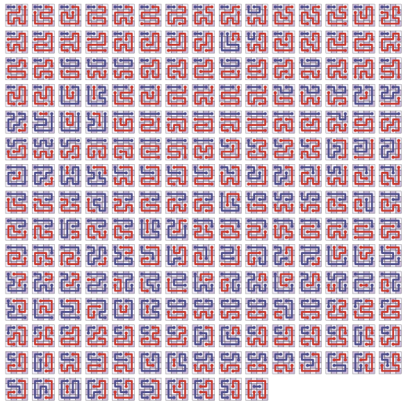
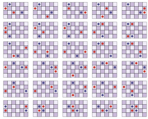

Rectangular 2D $k=2$ Zig-Zag Numberlink (R2K2ZNN)
===

###### 2026-01-06

The rectangular 2D $k=2$ zig-zag numberlink problem is, given a 2D
integral rectangular grid with two pairs of start and end points,
$( s _ 0, t _ 0), (s _ 1, t _ 1)$, ( $s _ k, t _ k \in \mathbb{Z}^2$ ),
find two paths connecting $s _ 0$ to $t _ 0$ and $s _ 1$ to $t _ 1$
that fills the whole rectangle without crossing or re-using vertices.

There is a program called *Flow Free* that implements this idea as a game
for arbitrary number of start and endpoints ( $k$ is unrestricted).

We are concerned about the $k=2$ scenario here.

Prior Work
---

In *Adcock et al.* they show that the general problem, when the number of start
and endpoints is allowed as an arbitrary, but fixed, parameter, the problem
becomes NP-Complete.
*Adcock et al.* conclude with an open problem of whether for fixed $k$ the problem
becomes polynomial.

It is our opinion that for $k=2$, on rectangular regions, the problem is polynomial time solvable.
The purpose of the code in this sub directory is an effort towards that investigation.

For comparison, the problem of finding a Hamiltonian path on a 2D rectangle with arbitrary
start and endpoints is polynomial time solvable ( *IPS* ).
We call this the $st$-Hamiltonian path problem on 2D rectangles.
This can alternatively be called a rectangular 2D $k=1$ zig-zag numberlink problem.

The strategy in *IPS* is to have a test for inadmissible Hamiltonian cycles for a small
pattern library of sub-problems and then provide operations to *strip* and *split*.
Stripping involves reducing the rectangle to two portions ( $R = (R _ 0, R _ 1)$ ),
with $s,t \in R _ 1$ and rules on how to join it to $R _ 0$ (with two edges via a square
edge flip).
Splitting involves reducing the rectangle to two portions ( $R = (R _ 0, R _ 1)$ )
but now with $s \in R _ 0$ and $t \in R _ 1$ and with rules on how to join $R _ 0$ to
$R _ 1$ by a single edge.

*IPS* shows that, assuming the problem is acceptable (has no forbidden configurations) and if no
strip or split is possible, then there are only a (small) finite number of *prime problem*
configurations that need be considered, which each have a solution.

Utility
---

I'm not sure I can make a good case for why this problem is important but it's come up,
for me, in various forms when considering other problems.

In the $st$-Gilbert problem, where we want to fill a rectangle with a space filling like curve
but we've specified arbitrary endpoints, a natural way of subdividing the space yields a
type of R2K2ZZN problem to solve when the endpoints land in a Siberian that needs to connect
to neighboring partitioned spaces.

In the $st$-Hamiltonian path on solid grid graphs, the proof strategy of attempting to subdivide
the solid grid graph via a rectangular partition (of the implied rectilinear polygon)
gives, in the case when the $s,t$ endpoints are both in a sub-rectangle, an R2K2ZZN problem
when trying to join the rectangle up to its neighbors.

If an algorithm did exist the for the $k=2$ case, it might give insight into algorithms,
polynomial or otherwise, for larger, but finite, $k$.

Intuition
---

The overall goal is to find simple tests for admissibility or inadmissibility along with ways on
subdividing the problem and joining them.
We have a coarse test, color compatibility, that we use as a baseline to consider endpoint pairs
but we need other, more complicated, tests to see if a solution is precluded.

The intuition is that, for the R2K2ZZN problem, there might be only a finite number of inadmissible
special cases that need be considered to prove no solution exists.
If the instance passes the inadmissibility tests, then a similar procedure might be able to be used to split
and strip sub-problems with various combinations of start and end points in each sub-region.

It's not clear what tests should be used to test for inadmissibility, or if they can even be classified
cleanly.

Another piece of intuition is that, in the "large system limit", if $s _ 0$, $t _ 0$, $s _ 1$, $t _ 1$
are sufficiently apart from each other and have sufficient distance from the edges and corners,
then stripping and splitting can be done more simply.
For example, if $s _ 0, t _ 0$ are on the left, $s _ 1, t _ 1$ on the right, with each separate from
each other and distanced from the corners and edges, this reduces to to joined $st$-Hamiltonian problems.
Though more complicated, similar arguments can be made if $s _ 0, t _ 0$ are diagonal with $s _ 1, t _ 1$
diagonal in the opposite direction, with sub-rectangles partitioned and joined via simple $st$-Hamiltonian
paths on each of the rectangular subdivisions.

So the general strategy is to isolate the start and endpoints into small fenced in regions and then join
or extend those regions to the remaining grid for a complete solution.

The current line of investigation is to enumerate some number of small grids and the start and end points
that preclude a solution to see if there's a way to classify them.
My suspicion is that for sufficiently large rectangles, if the endpoints are sufficiently distanced
from the corners and edges, then it's almost surely solvable.

This is analogous to the *antipodes* argument provided in *IPS*.
Their argument, if I understand it right, is that if the solution can't be stripped, then the remaining
sub-problem has antipodes.
If it has antipodes, it's either small and prime or can be split.

So the idea is to show a similar structure, where we try to strip the R2K2ZZN problem to get endpoints
fenced in.
If they're fenced into a region, it's either small and solvable or it's large but with endpoints near
the edges and corners, which means we can split the interior and make progress.

This hinges on there being an easily classifiable number of inadmissible patterns for endpoints sufficiently
distant from the corners and edges.

There are already cases where configurations preclude answers, for example when $s _ 0, s _ 1, t _ 1, t _ 0$
are in a small 2x2 square, but I'm hoping the number of these configurations is small, finite and easily classifiable.

Inadmissible Start Pairs
---

The above shows inadmissible endpoint locations for $3 \times 2$, $3 \times 3$, $4 \times 2$, $4 \times 3$ and $4 \times 4$.

I still don't have a good understanding of what makes starting pairs of endpoints invalid but some
obvious ones are:

* if the endpoints are all on the perimeter and alternate $(s _ 0, s _ 1, t _ 0, t _ t)$, then this invalidates an answer
  as a connected path from one pair of endpoints will cut off a path to the other
* similarly if there is a 2x2 square in the center that alternates $\left[ \begin{array}{cc} s _ 0 & s _ 1 \\ t _ 1 & t _ 0 \end{array} \right]$,
  the path for $(s _ 0, t _ 0)$, say, must go on the outside and cut off $s _ 1$ from connecting to $t _ 1$
* if there is an open corner square that have different path endpoints to its two neighbors
* if there is an open corner square with an open neighbor but completely enclosed by three endpoints

My current tactic is not so much to get a simple description of all the ways inadmissible pairings can occur but to
try and get a library of inadmissible configurations for a finite set.
The hope is that the inadmissible set can be automated, essentially, brute forcing enumeration so that it can be looked
up as inadmissible.

There will be a class of inadmissible endpoint configurations, no matter the size of the rectangle, and this is
what needs to be understood before any stripping or splitting can occur.
The above already has one such class, the 2x2 squares with alternating endpoints, as they can occur anywhere in a rectangle
no matter the size.

The hope is to examine enough small cases (8x8, 16x16, 32x32, etc) to see if there's a pattern to the class of size
unrestricted inadmissible endpoint configurations.

Going Forward
---

My suspicion is that it'll be enough to consider a small strip of 4-8 cells on the outer boundary.
I suspect this is closer to 4, as the endpoints need to conspire with each other to preclude a solution.

This means, ideally, it would be nice to enumerate large enough grids to see what kind of patterns
exist in the middle, away from 4 strip on the boundary.
A good test would be 32x32 but I think it'll be better to try and work up to that size in phases.

There are some practical issues:

* the size of the number of configurations we're processing
  - how to store them
  - how to visualize and/or classify them
* the time it takes to find a solution
  - how to speed up the solver

It's not clear how quickly these grow but an upper bound is $(n \cdot m)^4$.

As a better back-of-the-envelope bound:

* Roughly, the chance of being color compatible is $\frac{1}{4}$.
* Permutation symmetry of the start/end points yields $\sim (2 \cdot 2 \cdot 2) = 8$
* Flip symmetry yields $\sim (2 \cdot 2 \cdot 2)$
* Rotation, if it exists, yields $\sim (2 \cdot 2)$

All together, this gives about a factor of 1000 ( $4 \cdot (2 \cdot 2 \cdot 2) \cdot (2 \cdot 2 \cdot 2) \cdot (2 \cdot 2) = 1024$ ).
It's too small to make any real statement, but the 5x5 has 103 inadmissible configurations and 1193 admissible configurations,
which roughly checks out ( $(5 \cdot 5)^4 / 250 \sim 1500$ ).
Considering rotations might be too optimistic, so the factor might be closer to $\frac{1}{250}$.

For some real numbers:

* $16 \times 16 / 250 \sim 10M$
* $20 \times 20 / 250 \sim 100M$
* $32 \times 32 / 250 \sim 5B$

Which is reasonable, depending on how long the solver takes.

For the solver, besides doing a straight forward recursive solution, one optimization is to
consider the degree of neighboring cells.
As the paths are attempted, neighboring cells degree can be reduced.
If there's a neighboring cell that has degree 1 or 0, we can stop the search early.

Ordering traversal by proximity to edges and endpoints can also help speed up search.

References
---

* ["Zig-Zag Numberlink is NP-Complete" by Adcock et al.](https://arxiv.org/abs/1410.5845)
* ["Hamilton paths in grid graphs" Itai, Papadimitriou, Szwarcfiter (IPS)](https://www.ibr.cs.tu-bs.de/courses/ws2223/ag/papers/Ch8/1982-Itai_GridGraphs.pdf)
