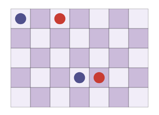

Notes
===

###### 2026-09-23

The goal is to find a finite number of patterns that classify when
an initial configuration is good or bad.
The working premise is that the number of classifiable patterns
is finite, so can be tested for.
If the pattern matches pass, so there's no reason why there wouldn't be
a solution, then the idea is to then use some type of recursive algorithm
to descend onto a solution.

It's clear there are a few necessary conditions:

We'll be using $R(n,m)$ with $n$ rows, $m$ columns.
$s _ 0, t _ 0,  s _ 1, t _ 1$ will be endpoints,
which can be references as e.g. $s  _ 0 = (s _ {0,x}, s _ {0,y})$,
where $s _ {0,x}$ is the column and $s _ {0,y}$ is the row ($R(n,m)$ is
reversed in this way as $R(\text{rows},\test{columns})$ has the y-axis
first).

* color compatibility
* topological compatibility
  - endpoints around the perimeter can't alternate
  - a $2 \cross 2$ square can't have an alternating endpoint pattern
* constraint compatibility
  - follow local constraints to extend path to make sure no contradictions
    are encountered
  - do a topological compatibility test after constraint propagation has settled

The above conditions are necessary but insufficient.

There are some solutions where inference needs to be done.

Here are some examples:

| | |
|---|---|
|  |  |
