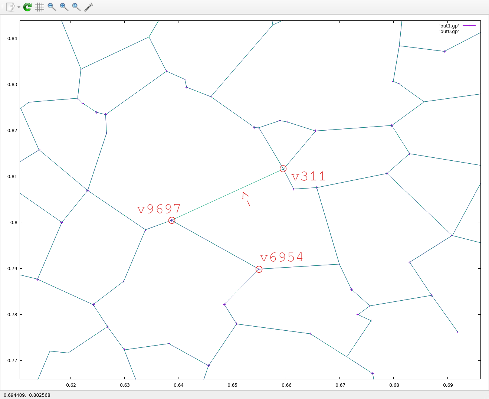
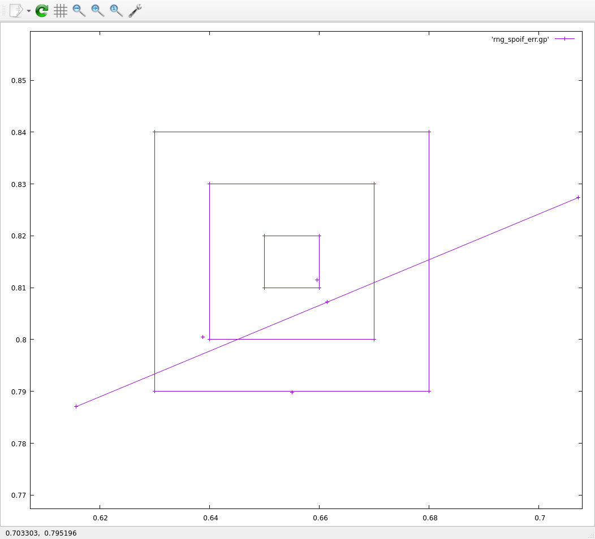

Debug-Log
===

###### 2026-07-13

A bigger bug was found:

* if OOB secured the fence, indicies within the current fence weren't added
  - for small examples this triggered a difference in naive vs SPoIF
  - since (hopefully) fixed

A trivial but annoying bug:

* `ofn` initial value was causing havoc with stdout
  - `ofn` was set to `/dev/stdout`
  - `if (ofn.size == 0) { fp = fopen( ofn.c_str(), "w" ); }`
  - so we'd open a file handle to `/dev/stdout` but we'd also be `fprint`ing to `stdout`
    trampling over each other
  - later, `fp` would be closed if not `stdout`, terminating stream
  - documenting to try and mitigate future frustration

Now it looks like there's another bug:

* `n=10000, seed=34, dim=2`
  - an edge appears in SPoIF but not in naive

This is the difference in edge files:

```
< 0.568188 0.710379
< 
< 
< 0.588827 0.699033
```

```
# P[8219]: 0.568188 0.710379
# P[1774]: 0.588827 0.699033
```

It looks like SPoIF thinks there's an edge between those two (when there shouldn't be).

I believe `P[6548]: 0.587679 0.720780` should act as a saboteur

```
var u = [0.568188,0.710379],
    v = [0.588827,0.699033],
    w = [0.587679,0.720780];
in_lune(u,v,w);
true
```

so `w` is the culprit.

It looks like `p8219` is evaluated correctly but `p1774` is picking up that edge.

ok, looks like it was this line ([link](https://github.com/zzyzek/sandbox/blob/c1910609e4ccc15cc6bb99fe1c58de140c0c5937/rng/rng_spoif.cpp#L746)):

```
...
      for (sqj=0; sqj < (int64_t)q_saboteur.size(); sqj++) {
        if (sqi == sqj) { continue; } // !!!!
        u_idx = q_saboteur[sqj];
...
```

This was inhereted from processing `q_sched` above.
`q_saboteur` is completely separate so nothing in it needs to be
skipped.

The problem size was big enough so that it just happened to skip a point that
would otherwise have acted as a saboteur to the edge.
Here, `p6548` acted as a saboteur to `(8219,1774)` but was skipped (incorrectly)
when considering the edge `(1774,8219)`.

This test case is passing now.


###### 2026-07-09

I'm debugging an issue with RNG SPoIF and I need to make some notes to keep things clear.

### Errr log

To reproduce: Run SPoIF 2d on 10,000 vertices with seed 1234 and compare with RNG naive:

```
$ ./rng_spoif 2d 10000
...
MISMATCH: |rng0.m_Ve_map[311]|:4 (0.659538,0.811543,0.000000) != |rng1.m_Ve_map[311]|:3 (0.659538,0.811543,0.000000)
  nei0: u3617(0.665509,0.819828) u5075(0.661445,0.807216) u7655(0.654958,0.820510) u9697(0.638765,0.800436)
  nei1: u3617(0.665509,0.819828) u5075(0.661445,0.807216) u7655(0.654958,0.820510)
#got: -3 (0 0)
```

| |
|---|
|  |

SPoIF has an edge that shouldn't be there from vertex `311 @ [0.659538,0.811543]`)
to vertex `9697 @ [0.638765,0.800436]`.

I believe vertex `6954 @ [0.655036,0.789833]` should exclude the edge from `v311` to `v9697`.

As confirmation:

```
> in_lune( [0.659538,0.811543], [0.638765,0.800436], [0.655036,0.789833] )
true
```

The grid cell each of the points in question (`grid_n = 100`):

```
v311 :  [65,81]
v9697:  [63,80]
v6954:  [65,78]
```

So the grid radius (`ir`) needs to be 3 in order to catch it.

Looking at the logs, it looks like the fence got secured at `ir:2`, so
the fence got secured prematurely, which is why `v6954` wasn't included
and we have the extraneous edge.

`v6954` is lower than `v311`, so I think it suffices to find how the lower fence is secured.

---

This may be a conceptual error and maybe securing the fence isn't enough to batch the nodes for
naive rng determination.

`v5075 @ [0.661445,0.807216]` might secure the bottom fence prematurely, excluding `v6954` from
the naive rng that's needed to run.

This confirms it:

| |
|---|
|  |

---

I have to think about this a bit but (I think) a way to salvage this is, once the fence is secured,
take all points within the fence, calculate all lune endpoints from the anchor and
take a grid box that encloses everything.

The widened grid box radius will never be more than double the current grid radius (I'm hoping,
this needs proof) so won't inflate things too badly.
Most of the time I think we'll only need to widen the grid box by 1 or 2.
