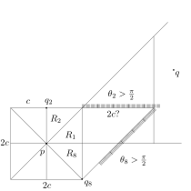

Relative Neighborhood Graph Notes
===

We only deal in $\mathbb{R}$ space.

Definitions
---

* $d$ - dimension
* $V$ - set of points/vertices (in dimension $d$)
* $n = |V|$
* $\delta _ p (x,y) = \delta _ {p, (x,y)}$ - distance between points $x$ and $y$ ($p$ not specified $\to p=2$)
  - $\delta _ 2 (x,y) = \delta _ {x,y}$
* $L _ p$ - distance metric for $1 < p < \infty$ ($\to \delta _ p (x,y) = [ \sum _ {i=0} ^ {d-1} | x _ i - y _ i | ^ p ]^ \frac{1}{p}$)
  - $L _ 1 \to \delta _ 1 (x,y) = \sum _ {i=0} ^ d |x _ i - y _ i |$
  - $L _ 2$ - Euclidean distance metric
  - $L _ { \infty } \to \delta _ { \infty } (x,y)  = \max _ {0 \le i < d}  |x _ i - y _ i |$
  - $L _ \rho$ for $\rho \in ( 1, \{ 1 < p < \infty \}, \infty )$

$$
\begin{array}{l}
B(x,r) = \\{ y | \delta(x,y) < r \\} \\
\bar{B}(x,r) = \\{ y | \delta(x,y) \le r \\} \\
\Lambda _ {p,q} = B(p, \delta _ {p,q}) \cap B(q, \delta _ {q,p}) \\
RNG(V) = \\{ (p,q) | \Lambda _ {p,q} \cap V = \emptyset \\} \\
\Gamma _ {p,q} = B( \frac{p+q}{2}, \frac{ \delta _ {p,q} }{2} ) \\
GG(V) = \\{ (p,q) | \Gamma _ {p,q} \cap V = \emptyset \\} \\
U _ {p,q} (\beta) = B( p + \beta \frac{q-p}{2}, \beta \frac{ \delta _ {p,q} }{2} ) \cap B( q + \beta \frac{p-q}{2}, \beta \frac{ \delta _ {q,p} }{2} ) \\
G _ { \beta } (V) = \\{ (p,q) | U _ {p,q} (\beta) \cap V = \emptyset \\} \\
\end{array}
$$

* $RNG(V)$ : relative neighborhood graph
* $GG(V)$ : Gabriel graph
* $G _ { \beta } (V)$ : $\beta$-skeleton neighborhood graph
  - $G _ 2 (V) = RNG(V)$
  - $G _ 1 (V) = GG(V)$
* $MST(V)$ : minimum spanning tree
* $DT(V)$ : Delaunay triangulation

Sizes
---

* $d=2$, $\beta \ge 1$, $\rho=2$, $G _ { \beta } (V)$ can be constructed in $O( |V| \lg |V| )$ time
* $d=2$, $MST(V) \subseteq RNG(V) \subseteq DT(V)$
  - $|MST(V)| \le |RNG(V)| \le |DT(V)|$
* $L _ p$, $1 \le \beta \le 2$, $MST(V) \subseteq G _ { \beta } (V) \subseteq DT(V)$
* $L _ p$, $|V|-1 \le |RNG(V)| \le 3 |V| - 6$
  - $L _ 2$, $d=2$, $|V| \ge 8$, $|V|-1 \le |RNG(V)| \le 3|V| - 10$
* $L _ p$,  $|V|-1 \le |GG(V)| \le 3|V| - 8$
* $L _ 1$ or $L _ { \infty }$, $|RNG(V)| = \Theta( |V|^2 )$
* $d \ge 4$, $|RNG(V)| = \Omega( |V|^2 )$
* $L _ 2$, $d = 3$, $|RNG(V)| = O(|V| ^ { \frac{4}{3} })$
* $L _ p$, no isosceles triangles $\to max _ { v \in V } \deg(v) < c$
  - in this case $|RNG(V)| \le c|V|$
  - $L _ p$, $\forall d$, if $\forall x,y,u,v \in V, \delta _ p (x,y) \ne \delta _ p (u,v) \to |RNG(V) \le c |V|$

Algorithms
---


* $\text{runtime}( \text{Alg} _ {RNG}(V) ) = \Theta( |V|^3 )$ (naive)
* $\text{runtime}( \text{Alg}( DT(V) ) _ {RNG} ) = O( |V|^2 )$ (Delaunay triangulation speedup)

NOTE: I don't know what JT is smoking but it looks like $d=2, L _ 2, O(n)$ is completely missed in the table, even
though he talks about it explicitly.
I also don't trust that a generic condition $d=3, L _ 2, O(n)$ hadn't been discovered at that point.

### KN85

I'm only going to talk about the generic case.

Assume $|V|=n$ points in the unit square, distributed generically (Poisson point process).

The bulk of the KN85 algorithm works by considering radial regions for each point, computing the nearest neighbor in
the six radial slices and noticing that this graph, called the "geographic neighborhood graph" (GNG), is a super set of the
relative neighborhood graph (RNG) of the point in question.
To find nearest points to construct the GNG, the cells are walked in a spiral fashion, effectively considering nearer
cells first to do the distance test (maybe Bresenham's circle drawing would be more effective?).

For a point $p$ far enough away from the edge, the $GNG(p)$ is effectively bounded, so one can just do a naive algorithm
on the points in $GNG(p)$.
The "spiral out" walk starts to falter when the points are too close to the boundary and special consideration needs to be
taken.

Cell sizes are (I believe) chosen to be roughly $\frac{1}{\sqrt(n)}$.
The grid is further partitioned into "outer", "middle" and "inner" regions.
The outer region cells are defined to be the cells in the band of $C \log(n)$ from the edge.
The middle region are from $2C \log(n)$ to the outer band.
The inner cells are the rest.

In some "generic" configuration,
the outer cells (and maybe the middle cells?) only contain a small number of points, so I think
the idea is that you can just run a naive algorithm on those points without blowing your budget.

Under generic conditions (for $d=2$, $L _ 2$), the algorithm works in expected linear time ($O(n)$).

Some takeaways:

* $RNG(v) \subseteq GNG(v)$ ($v$ a single point)
* There are six regions, most likely due to the maximum (generic) neighbor count
* The special handling of border cells/points is handled in another algorithm/paper which
  I'm trying to find
* The worst case complexity comes from "pathological" cases when the points are exactly on the circle
  and don't trigger the removal because of the open nature of the regions

UPDATE:

To understand why special consideration needs to be done for points near the edge, both in the 6
region and 8 region case, consider a point very near one of the sides.
Let's say it's the closest point to the edge.

This means it needs to walk the entire row/column of grid cells in order to determine if it has a neighbor
or its hit an edge.
K&N claim that the uppermost point needs to do $O(n)$ work but I don't see why.
Instead, consider a special case where there are $\sqrt{n}$ points in the upper row (on average one
point per grid cell, $O(\sqrt{n})$ cells, so $O(\sqrt{n})$ points) ordered by decreasing height from left to right.
The left most point needs to traverse the whole top row on the right to fill $R _ 1$.
The next point will have the first point at it's left neighbor, $R _ 3$, but again needs to traverse
the whole right top row to fill it's $R _ 1$ wedge.
Doing this for all points in the top row gives $\sum _ {k=1} ^ {\sqrt{n}} k = O(n)$.
I'd have to think about it but I suspect random permutation doesn't save you.

This happens for both 6 and 8 regions.


### KNT87

* Now they believe the KN85 algorithm was 8 regions
  - 8 regions, up from 6, to help simplify the algorithm
  - They do other tricks so as not to handle edge cells as a special case and
    8 regions allows for an additional heuristic to stop the spiral search
* GNG has now turned into ARN (all region neighbors)

On further reading, I suspect this gives an $O(n)$ algorithm for $d=2, L _ 2$, and points in generic position.
I also suspect that this can be adapted pretty easily to 3d, but I need to investigate more.

The following focuses on $d=2, L _ 2$ and generic point positions.

The basis of the algorithm is:

* Assume $n$ points on unit square $((0,0), (1,0), (1,1), (0,1))$
* Partition the grid into $\frac{1}{\sqrt{n}}$ sized cells, using a linked list
  to store multiple points
* For each point $p = (x _ p, y _ p)$, create 8 radial regions centered at $p$
* Add virtual points $((0, y _ p), (1, y _ p), (x _ p, 0), (x _ p, 1))$ as sentinels
  for edge detection
* Spiral walk out from $p$, cataloging nearest point $q _ i$ in each region
  - Call a radial region "closed" if a $q _ j$ point is found in it
* Do this until no two adjacent radial regions are open or until the grid cells have
  been exhausted
* Call $SI _ p$ the square ("influence") centered at $p$ with side length $8 \cdot \max _ {j} ( d _ {\infty} (p, q _ j) )$
* Walk all grid cells in $SI _ p$ and collect points into list $L$
* Use the $q _ j$ and $L$ to find the $RNG(p)$

The idea is that, for a point $p$, the $RNG(p)$ is a sub graph if the $ARN(p)$, both of which are degree bounded.
Constructing the $ARN(p)$ might need to walk many cells if, say, $p$ was near the boundary (consider $p$ near the
bottom left edge, with the radial region creating a thin sliver of cells all the way up to top left).

With the condition that no two radial regions are open, we get some guarantees about how far we need to search
to find all $RNG(p)$ points.
Specifically, creating a square of radius $4 \cdot \max _ j ( d _ {\infty} (p,q _ j) )$ (total
side $8 \cdot \max _ j ( d _ {\infty} (p,q _ j) )$) gives us a small region to scan to guarantee
to find the $RNG(p)$ points.

The idea is that for points $p,q,v$, if the angle formed by $\theta(p,v,q) \ge \frac{\pi}{2}$, then $v \in \text{lune}(p,q)$.
Meaning, if the angle is too sharp between three points, the edge between the endpoints must be booted out of the $RNG$.

> [This] ... is a direct consequence of the cosine law of triangles

So if you have a point $q$ that's outside of $SI _ p$, there are a few cases:

* If $q$ is within a closed radial region, the point closer to $p$ that closed it precludes $(p,q)$ from being in the $RNG$
* If $q$ is in an open radial region, that means the neighboring radial regions, $R _ l, R _ r$, must be closed
  - naively, you might think there's a "worst case" scenario if the points closing $R _ l$ and $R _ r$ leave a narrow
    $\frac{\pi}{12}$ sliver because the $\frac{\pi}{3}$ angle they sweep only encroaches $\frac{\pi}{6}$ past the radial boundary,
    but in this extreme case, the points in $R _ l$ and $R _ r$ would preclude $p$ because of the triangle inequality,
    giving us more wiggle room and more information to work with

I think there's a nice picture that can be drawn, but I'm going to use words and hope that I have the inclination to do the
picture later:

* Consider $p$, $SI _ p$ with the "radius" of $SI _ p$ to be $4 c$ (total width $8 c$)
  - $c = c _ { \text{max},p } = \text{max} _ { j } ( d _ {\infty} (p, q _ j) )$, where $j$ is over closed radial regions only
* w.l.o.g. consider $q$ to be the point in the radial region $R _ 1$, with $R _ 1$ "open" and $R _ 2$ and $R _ 8$ closed
* Call $q _ 2$ and $q _ 8$ the points in $R _ 1$ and $R _ 8$ that closed them
* $|p,q _ 2| \le \sqrt{2} c$, $|p, q _ 8| \le \sqrt{2} c$, $|p, q| \ge 2 c$

Hm, I might be missing something but the way I see it, the $\theta _ 2 = \text{ang}(q,q _ 2,p)$ and $\theta _ 8 = \text{ang}(q, q _ 8, p)$
would exclude $(p,q)$ if the outer square is $3c$ radius ($6c$ on a side total).

That is, the worst case happens when $q _ 2$ is directly above $p$ (in radial region $R _ 2$), and when $q _ 8$ diagonal down from $p$,
making regions above the $q _ 2$ horizontal line and to the right of the diagonal line of perpendicular to $q _ 8$ regions where
$q$ would imply $\theta _ 2$ and $\theta _ 8$ to be greater than $\frac{\pi}{2}$.
In this case, it means either $q _ 2$ or $q _ 8$ is in the lune of $(p,q)$, excluding $(p,q)$ from the $RNG$.

The region to avoid is when $q$ is inside a box of radius $3c$ (side $6c$), so I'm confused as to the $4c$ requirement in the paper.

| |
|---|
|  |

This hasn't exploited the fact that there's a potential angle restriction for $\theta(q _ 2, p, q _ 8)$ but I'm not sure that
gives actionable information.

At any rate, the idea is that past a certain point, in the case that $R _ 2$ and $R _ 8$ are closed,
any $q$ chosen in radial region $R _ 1$ will have an angle too large
for one of $\theta _ 2 = \theta(q, q _ 2, p)$ or $\theta _ 8 = \theta(q, q _ 8, p)$ so that $q _ 2$ or $q _ 8$ falls
within the lune of $(p,q)$, excluding $(p,q)$ from the $RNG$.

Once we have our $ARN$ with no two open radial regions next to each other, we can then bound the box to sweep/check
for other points.


### BEY91

Closely related is the Delaunay triangulation.

BEY show that the expected maximum degree of $DT(V)$ is $\Theta( \frac{ \log n }{ \log \log n } )$.

From the paper:

> In both cases, the strategy for the upper bound is to show that if a site has high degree ...
> then either it touches an unusually large empty sphere or its DT neighbors are
> unusually close to each other.

### Ideas

Here's an idea for an algorithm:

* $n = |V|$, $v \in [0, 1)^2$ uniformly random
* Construct a grid, $G$, with cell size $(\sqrt{n},\sqrt{n})$
  - fill grid with points from $V$, with a linear linked list for duplicates
  - call the grid cells centered at $v$ of grid (integral) radius $r$ $G _ r (v)$
* For each point $v \in V$:
  - $P = \{v\}$
  - grid fence relative radius resolution point $F _ {r,u,l,d} = \{\infty\}$
  - for $r = \{0,1,\dots,\lceil \sqrt{n} \rceil\}$:
    + for all $u \in G _ r (v) - P$
      - find direction, $\{r,u,l,d\}$ and which relative grid radius, $r _ q$, secures the fence
      - if $r _ q < F _ {dir(u-v)}$:
        + $F _ {dir(u-v)} = r _ q$
      - $P = P \cup \{u\}$
    + if all $F _ {r,u,l,d} \le r$, break
  - Construct the $RNG(v)$ testing only points $u \in G _ r (v)$

The fence needs to be relative to the point $v$ above, encased by the current grid fence.

So, fence radius, $r _ {fence}$, is the minimum distance of point $v$ to the current grid region fence.
A fence edge will be resolved when it goes completely past the edge of the grid.

For simplicity, a fence edge that partially intersects the grid edge will still have it's boundary as if
it didn't intersect the grid boundary, so past the edge of the grid.
This might change later.

To calculate the point at which the line secures the fence, consider the example:

```

 .__________.      u
  \         |  ___/
   \   q ___|_/
    \  ./   |
     \      |      7 v
      \     |     /
       \    |    /
        \   |   /
         \  |  /
          \ | /
           \|/
            . p
```

$u, v$ are unit length.

Some elementary calculations:

$$
\begin{array}{lll}
 & & s _ q ( t _ 0 ) = q + t _ 0 u \\
 & & s _ p ( t _ 1 ) = p + t _ 1 v \\
\to & & q _ x - p _ x + t _ 0 u _ x - t _ 1 v _ x = 0 \\
   &  & q _ y - p _ y + t _ 0 u _ y - t _ 1 v _ y = 0 \\
\to & & (q _ x - p _ x) - \frac{v_x}{v_y}(q_y - p _ y) + t _ 0 (u _ x - \frac{v _ x}{v _ y}u _ y) = 0 \\
\to & t _ 0 & = \frac{ \frac{v _ x}{v _ y} ( q _ y - p _ y)-(q _ x - p _ x) }{ u _ x - \frac{v _ x}{ v _ y} u _ y } \\
&  & = \frac{v _ x (q _ y - p _ y) - v _ y(q _ x - p_ x)}{ v _ y u _ x - v _ x u _ y} \\
\to & t _ 1 & = v ^ {t} (s _ q(t _ 0) - p) \\
\to & t _ {I} & = \lceil \sqrt{2} t _ 1 - l _ 0 \rceil + 1\\
\end{array}
$$

Where $t _ I$ is the integral radius at which the $q \perp q$ line will secure the fence edge.
Here, $l _ 0$ is the initial length to the first fence around $p$.

Still thinking about this but I think for 3d, we can take the projection into one of the six sides that's
appropriate and make appropriate estimates for when the plane secures the fence face.

---

As a review, we only consider 2d and 3d with uniform random points in space restricted
to a unit cube.
Since the points are random, this ensures generic point configurations.
In particular, no three points lie on a line, no three points create an equilateral triangle.

The generic conditions ensures finite RNG degree in 2d and 3d.

There are two algorithms for 2d and 3d.
The 2d case is simpler so we'll focus on the 3d case.

* Secure fence
  - simple proof of concept to get $O(N)$ run time
* Secure fence, shrinking window
  - modification of secure fence to circumvent some potential bad cases
  - still $O(N)$

  
### Secure the Increasing Fence (StIF)


```
V - vertices
G - grid
RNG - output RNG graph

M = |V|^{1/3}
s = 1 / |V|^{1/3}

Create grid, G, of grid cell size s, ( each dimension of integral value ceil(M) )
Foreach p in V:
  Place p in G, using a linear linked list for grid collisions

Foreach p in V:
  fence = [M,M, M,M, M,M]
  PointsInFence = []
  for R=0 to M
    if ( max _ { d \in \{0..5\} } fence[d] ) < R: break
    Take square sub-grid, H, of grid G that has Manhattan radius of R with p at it's center
    L_0 = minimum absolute distance of p to sub-grid H
    create frustum vectors, bounding volume, and other 3d geometry and vector information,
      F_0, F_1, F_2, F_3, F_4, F_5 in each of the idir directions, of size s.
      Call F_{d,v_j} the (four, $j \in \{0..3\}$) frustum vectors of length s each.
    foreach q not seen in H / p:
      PointsInFence.push(q)
      D_i = index of which unrestricted frustum q falls into relative to p (idir of q relative to p)
      // Find maximum units that frustum vector $v_j$ intersects plane defined by $q$. That is:
      // ( (q-p) / |q-p| ) \cdot ( p + t v_j - q ) = 0
      t = max _ {j \in \{0..3\}} |p-q|^2 / ( (q-p) \cdot v_j )
      if t < fence[D_i]: fence[D_i] = t
  
  RNG += NaiveRNG(p, PointsInFence)
```

Consider an anchor point $p$ and a candidate point $q$.
Point $q$ excludes any potential point, $u$, that lie on the other side of
the half plane cut, $\frac{q-p}{|q-p|} \cdot (u - q) = 0$.

We could create a convex hull from the half plane cuts created by the $q$ neighboring
points of $p$ but this might be costly.
Instead, we only keep summary information of when the half plane fully encloses a
growing 'fence' around $p$, where the fence is aligned with the binning grid.

Each $q$ has the potential to 'secure' a fence face, where a secured fence has
a recorded time of at least one $q-p$ plane fully enclosing the fence face
less than the current fence radius.
When all fence faces have been secured, we can stop and then run naive RNG
on all $q$ points within the current sub-grid fence.

Since the RNG degree is finite, we know the expected size of the growing sub-grid fence
is finite.
The finite sub-grid fence has an expected finite number of $q$ points within it (as
well as finite variance), which gives an $O(N)$ algorithm.

All this sounds complicated but it really is a simple (potentially trivial) extension to Jaromczyk & Toussainty,
using one of their lemmas.

A graphic will help.

### Shrinking Window, Increasing Fence (SWIF)

JT and KN85 (2d) linear time algorithms rely on some complicated book-keeping by either considering edge
or corner points differently, or doing some analysis on the regions filled for an anchor point $p$.
Choosing $q$ planes, as in StIF above, avoid the special cases and more complicated region analysis
because the $q$ planes are orthogonal the the $q-p$ vector and regions of the JT and KN85 algorithms.

In my opinion, one deeper issue is that if points are restricted to a certain simple geometry that
isn't well conditioned to the algorithm, things might fail.
In the case of JT and KN85, their regions meant that the unit square was a special case they had
to guard against to keep their $O(N)$ algorithm.
Other algorithms might have other simple geometry that could foil it through simple
restrictions of point placement, even if points were still placed randomly within the restricted
space.

StIF above has the limitation that if points lie on a sliver just above an axis aligned plane,
they wouldn't secure the fence with a value less than the grid size.
This means that for certain simple "antagonistic" geometry, StIF would become quadratic, or worse,
because of these points on the edge.
This is reminiscent of the KN85 algorithm that needs to make special consideration for points near
the edges of the grid.

To overcome this, a shrinking window, increasing fence algorithm (SWIF) can be made that keeps
more fine-grained book-keeping on where the $q$ planes intersect the growing grid.
Instead of just keeping a single "time" value of when we know where the $q$ plane will fully enclose
a fence face, we can keep information on a bounding window of where the $q$ plane intersects the
fence face.

When all the bounding windows on each of the fence face disappears, we know the fence is secured.

The plane cuts from $q$ points on the sliver above of the axis-aligned planes will effectively
only update the window bounds on one side.
By itself, this wouldn't offer any relief, but paired with another method that could identify
spatial regions where points are restricted from placement and then using them to update the
window will help secure the fence even with these problem points.

Here, the window is needed as keeping granularity on the whole fence face might fail for points
that prevent the whole fence face to be secured through simple restricted geometry heuristics.


Again, a graphic will help.

So, while the window book-keeping complicates the basic StIF algorithm, the idea generalizes
to 3d much more easily (in my opinion) than the JT algorithm.
The JT algorithm could be extended and rely on some coupon collector property to fill the regions
but has the same general limitation of ill conditioned restrictive geometry.
JT overcomes this by waiting for a checkerboard pattern in the region binning and I suspect
this gets intricate and complicated for 3d.

Regardless, I'm not saying JT can't be extended, potentially naturally or easily to 3d, but,
again in my opinion, conceptually SWIF is simpler to reason about and implement.

---


Some points:

* JT and KN85 are really only specified for random 2d points restricted to the square
* Given a Delaunay triangulation on random points (2d/3d), expected linear or $O(N \lg N)$ algorithms exist
  but the DT triangulation itself can be tricky as even for generic points the maximum degree can be
  unbounded ($O(N)$ in some cases) meaning that both the DT will require super linear time to compute
* JT can potentially be extended to 3d but it's not clear how to do this naturally or simply
* StIF gives a conceptually simple expected $O(N)$ time on square/cube restricted random points
  but suffers for other restricted geometry, even if the restrictive geometry itself is very simple
* SWIF adds some conceptual complexity by book-keeping the bounding windows in each face but recaptures
  the expected linear run-time and addresses the ill conditioned restrictive geometry condition
* *but* both StIF and SWIF suffer from large overhead as the number of neighboring $q$ points is
  finite but potentially large (80+, depending on dimension and other restrictions) where, at least
  in its simple formulation, a naive RNG calculation would need to be run on this large (but finite)
  set of points
  - This means StIF and SWIF are only for larger data sets where overhead is minimal compared with
    algorithmic run times
  - Future work can be done to try and speed up RNG calculations on the finite subsets
* For SWIF, I haven't really gone into it but there's another facility to figure out when the window can
  be further restricted when the frustum faces start colliding with the dead space of restricted geometry
  - In the back of my mind I have an idea of an octree or bounding box regions (maybe of size $s$) that
    can be used to decide if a frustum window portion falls completely in the restricted zone and can
    be further shrunk
  - The other (implicit) assumption is that the restrictive geometry does not allow for any RNG edges
    through it
* One simple hack is to just rotate the points by some random value and run the algorithm. I find
  this unsatisfying as it's not clear what a good rotation is and whether it'll really address many
  of the concerns, but this is always a possibility. Constant $K$ rotations, under some conditions, might
  give exponentially more confident guarantees on expected linear time (though in some cases they may
  not?)

Though it should be clear, as a another reminder, StIF and SWIF are only meant to work on random
points restricted to simple geometry.
Structured point distributions can cause worst case complexity ($O(N^3)$) as can more complex
restrictive geometry.

Generic point distributions on complex geometry is, in some sense, interchangeable with structured
point distribution on simple geometry.
The exact definitions of what "complex" and "simple" mean in this context are vague and I won't go
into it further.

Maybe it's worth just using rectangular cuboids and their rotations to highlight the benefits
and shortcomings of each algorithm.

---

I'm still trying to figure out the window update calculation.
These are notes for it.

w.l.o.g., consider `idir` 0 (`+x`), frustum vectors `[[1,1,1],[1,-1,1],[1,-1,-1],[1,1,-1]]`,
$p$ considered at origin (`[0,0,0]`) and a random $q$ point inside of this frustum.

* Frustum with vectors $(v _ 0, v _ 1, v _ 2, v _ 3) = [[1,1,1],[1,-1,1],[1,-1,-1],[1,1,-1]]$
  - Frustum lines $k \in \{0 \dots 3\}$, $v _ k(t) = t \cdot v _ k$
* Window direction vectors
  - $v _ {0,1} = v _ 1 - v _ 0$
  - $v _ {1,2} = v _ 2 - v _ 1$
  - $v _ {2,3} = v _ 3 - v _ 2$
  - $v _ {3,0} = v _ 3 - v _ 0$
* Window line vectors: $k \in \{0 \dots 3\}$, $v _ {k,(k+1)\%4}(t) = v _ k + t \cdot v _ {k,k+1}$
* $q$ random point inside Frustum $(v _ 0, v _ 1, v _ 2, v _ 3 )$
  - $N _ q = \frac{q}{|q|}$
  - $Q(u) = N _ q \cdot ( u - q )$, ($Q(u)=0$ plane equation)

```
.________.
|   /\   |
| 3/  \3 |
| /    \ |
|/      \|  ^
|\   4  /|  |
| \    / |  z
| 3\  /3 |  |
|   \/   |
---------- 
  = y => 
     .
    / \
  --   --
  \  x  /
    \ /
```

If the point $q$ falls within the
diamond `4` region, the plane intersects each of the frustum vectors going away from the origin.
That is, the $Q$ plane that intersects each of $Q( v _ k(t _ k) ) = 0 \to t _ k > 0$.

If the point $q$ falls within the
quarter `3` diamond regions, there will be three frustum vector intersections away from the origin.
The other frustum vector will intersect in the negative $t$ direction.
That is, there will be three $t _ k > 0$ and one $t _ {k'} < 0$.

For example, if $q$ is in the upper right hand corner,
$Q( v _ 0(t _ 0) ) = 0 \to t _ 0 < 0$ and $t _ 1,  t _ 2, t _ 3 > 0$.

So, define the fence edge by the counter clockwise rotation around the frustum vectors, aka
the window direction vectors.
For each window direction vector, store two numbers, the 'source' edge and the 'destination' edge.
Call them $v _ {k,\text{src}}$ and $v _ {k,\text{dst}}$ respectively.

For each $0 < t _ k < 1$ such that $Q( v _ {k,(k+1) \% 4}(t _ k) ) = 0$, if $Q( v _ k ) > 0$,
update $v _ {k,\text{src} = t _ k$, else if $Q( v _ k ) < 0$, $v _ {k,\text{dst}} = 1-t _ k$.


---

Here's a high level overview:

```
SWIF3D(P):
  gridN = ceil( |P|^{1/3} )
  bin P into grid G[gridN,gridN,gridN]
  for p in P:
    platList = [], qCarry = []
    init coarseFence, windowFence
    for ir in [0 .. gridN]:
      inflate/update coarseFence with ir
      inflate/update windowFence with ir
      if (coarseFence secured) or (windowFence closed): break
      fence           = Fence(G, p, ir)
      platPerimeter   = PlatPerimeter(G,p,ir) // sub grid
      tmpCarry = []
      for q in {platPerimeter, qCarry}:
        if !(q in qCarry): platList.push(q)
        if !(q in fence): tmpCarry.push(q), continue
        update coarseFence with q
        update windowFence with q
      qCarry = tmpCarry

    NaiveRNG(p, platList)
```

coarseFence might be redundant here.


---

The motivation for the shrinking fence is to allow for some of the simple bad cases to be handled.
For example, in 2D, if there's a sliver of points with slope $\frac{pi}{4} + \epsilon$, the top fence
will likely not be secured as the slope of the perpendicular line of the $q$ points will be nearly
$\frac{3 pi}{4}$, never securing the fence.

If we had regions labeled as inadmissible, marking the grid binning regions, say, if they're fully
enclosed by the inadmissible region, then we could use them to update the shrinking fence, taking
care of these conditions.

Labeling inadmissible regions has to be done extrinsically, as it requires knowledge about the point
distribution and region.
We can make some simplifying assumptions, like the region is a convex set and try to find a bounding
convex region to inform marking which grid boxes as inadmissible.
In general, though, we need to specify it.
For example, having a leaf silhouette has many concave regions that would need to be explicitly
labeled in order to update the shrinking fence.


References
---

* [JT] "Relative Neighborhood Graphs and Their Relatives" by Jerzy W. Jaromczyk and Godfried T. Toussainty
* [KN85] "Computing Relative Neighbourhood Graphs in the Plane" by J. Katajainen and O. Nevalainen (1985)
* [KNT86] "A Linear Expected-Time Algorithm For Computing Planar Relative Neighboourhood Graphs" by J. Katajainen, O. Nevalainen, J. Teuhola (1986)
* [BEY91] "The Expected Extremes in a Delaunay Triangulation" by M. Bern, D. Eppstein, F. Yao
