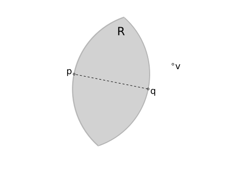
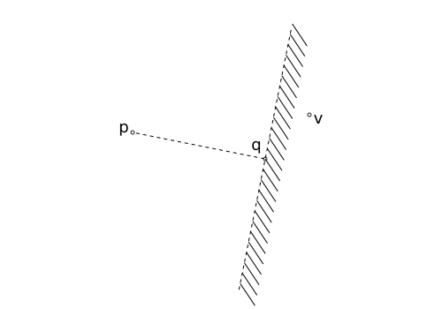

...
===

Consider a vertex set $V = \\{ v | v \in \mathbb{R}^d \\}$, $n = |V|$, where
we will be considering only $d \in \\{2,3\\}$ with a Euclidean distance metric.

Relative Neighborhood Graph (RNG)
---

The relative neighborhood graph, $\text{RNG}(V) = (V,E)$, is defined to be the
graph with sets of edges such that:

$$
\begin{array}{ll}
& (p,q) \in E \\
\to &
 \forall v \in V / \\{p,q\\}, \\
 & |p-q| \le \max( |p-v|, |q-v| )
\end{array}
$$



Take $p,q \in \mathbb{R}^d$, with $r _ {p,q} = |p-q|$.
Take the circle of radius $r _ {p,q}$ centered at $p$, $C _ p$,
and the circle of radius $r _ {p,q}$ centered at $q$, $C _ q$.
Call the intersection of the two circles, $R = C _ p \cap C _ q$,
the *lune* created by points $p,q$.

The relative neighborbood graph consists all edges, $(p,q)$, such
that there are no points in the lune between them.

In the illustration above, since $v$ is outside the lune region, $R$,
the edge, $(p,q)$,  is part of the relative neighborhood graph,
$(p,q) \in E$.

### Naive Relative Neighborhood Graph Algorithm

A naive $O(n^3)$ algorithm can be constructed to find the relative neighborhood
graph by considering all triples of points.

```
NaiveRelativeNeighborhoodGraph(V):
  E = {}
  for p in V:
    for q in V / p:

      accept_edge = true

      for v in V / {p,q}:
        if dist(p,v) < dist(p,q) and
           dist(q,v) < dist(p,q):
          accept_edge = false
          break

      if accept_edge:
        E += (p,q)

  return E
```

For a given point, $p$, if we had some knowledge about which
points in $V$ could never yield an edge connection, we could
speed up the above algorithm by not doing the distance calculations
in the first place.

This observation is the basis of many algorithms to speed up the relative
neighborhood graph algorithm.

Elimination Heuristics
---



Consider $p,q \in V$, and the hyperplane with normal ${\bf N} _ {q,p} = (q-p) / |q-p|$ passing
through $q$.

Regardless of whether $(p,q)$ is in $E$, for any point, $v$, lying on
the other side of the half plane, $(p,v) \notin E$ (triangle inequality).
This means when trying to find which edges $p$ has, for any given $q$,
we can eliminate any point that lies on the other side of the half plane
from consideration to connect to $p$.

The heuristic is rough but easy to calculate.

Finite Degree For Random Points
---

The average and maximum degree are almost surely constant for
the relative neighborhood graph in 2d and 3d when points are random.
The more specific condition is that there are no isosceles triangles
in the point set.

$$
\max _ {v \in V} \deg(v) < c < \infty
$$

Grid Binning
---

Consider $n = |V|$ randomely chosen points in $[0 \dots 1]^d$, $d \in \{2,3\}$
(unit square, unit cube).

Choose a uniform grid with $m = \lceil n ^ {\frac{1}{d}} \rceil$ number of cells
and each cell having dimension $n^{-\frac{1}{d}}$.
We've chosen bin size to be roughly $m \sim n ^ {\frac{1}{d}}$ bins on a
side, giving us $m ^ d \sim n$ bins in total.

Process each point, $p \in V$, putting them in the appropriate bin,
adding them to a linear linked list if there's a collision.
This can be processed in $O(n)$ time, with $O(n)$ space.

This will give most bins constant occupancy.
Some bins will have max load roughly $(\ln(n) / \ln(\ln(n)))$ but
this happens so infrequently so as not to affect any amortized run-time
analysis that we will do ([see](#binning_runtime)).

Algorithm (speculative)
---

We're now in a position to describe the algorithm.

As of this writing, the algorithm is still an idea and hasn't been validated.

We start with a point set $V$, $n = |V|$.

* Initially, find the vertex convex hull of the entire point set
  - BCL93 can be used which has expected linear time
  - each vertex on the convex hull has an implicit splitting plane
    + think of a set of points in a circle around the point set at infinity
* Create the binning grid, $B$, and bin points within
* For each point, $p \in B$
  - $W$ = {}
  - While $p$ is not fenced in by a bounding convex hull $U$
    + take an initial grid cell window around that that point
    + find the vertex convex hull, $H$, of all points within that grid cell window
      - if one of points is on the outer convex hull boundary, add its splitting plane to the mix
    + find the vertex enumeration, $U$, interpreting $H$ as splitting half planes with
      the point as the normal direction and $p$ as the origin (that is, find the dual $U = \text{dual}(H)$ )
    + if the maximum distance of $p$ to $U$ is larger than some threshold, increment the grid window size and try again
    + otherwise add all points within the grid window that fully encompases $U$ to $W$
  - Run `NaiveRNG` on $W$

$W$ is expected linear, so all operations are linear as well, giving a linear expected time algorithm.

Appendix
---

### Point Set Maxima

Given a set of points in $\mathbb{R}^d$, find the *maxima of the point set*,
defined as the point or set of points not dominated by any others.

Here, a point, $p$, is said to dominate a point, $q$, if all coordinates in $p$
are larger than $q$.
That is $\forall i \in [0 \dots (d-1)], p _ i > q _ i$.

As an example, if points are taken to be in the unit sqaure from $[0,0]$ to $[1,1]$,
a point $p'$ dominates all other points $q'$ that are in the rectangle from $[0,0]$
to $[p' _ x, p' _ y]$.

Note that the maxima is not that a point $p$ *dominates* all other points, it's that
it's *not* dominated by any other point.
For example, the set containing the points $\{ [0,1], [1,0] \}$ has neither dominating
the other so either can be taken as the maxima or both can be taken as the maxima set
of points.

### Naive Vertex 3D Convex Hull

Our goal is, from a given set of vertices, $U \in \mathbb{R}^3$,
find a subset of vertices, $H \subseteq U$, of the vertices
that form a convex polytope fully encompasing $U$.

A naive $O(|U|^4)$ algorithm simply takes each triplet of points, $p, q, u \in U$,
and tests whether the plane constructed from the three points is to
one side of all other points.
If so, the plane is part of the convex hull and thus each of the three
points is part of the convex hull vertex set.
Otherwise, it's not.

```
NaiveConvexHull(U):

  H = {}
  for p,q,u in U:

    on_hull = true
    for v in U / {p,q,u}:
      w = cross3((q-p),(v-p))
      if sgn( dot((v-p),w) ) > 0:
        on_hull = false
        break

    if on_hull:
      H += {p,q,u}

  return H
```

Where the inner loop is constructing the normal from the three points and
then doing a sign test to see which side of the plane the test point is on.

Note that the above assumes no four points co-planar.
That is, the generic, or random, condition is that there are no degenerate
conditions to be taken care of.

### Naive Vertex Enumeration

We will need to convert from a convex hull defined by its vertices to a convex
hull defined by half plane cuts and vice versa.

We will concern ourselves with going from a representation of normals
given an origin point, $p _ 0$, and constructed vectors $\eta _ k = [ x _ k, y _ k, z _ k, d _k ]$,
with the normalized direction vector $(x _ k, y _ k, z _ k)$ and $d _ k$ the distance from $\eta _ k$ to $p _ 0$.

A naive $O(|H|^4)$ algorithm tries every triple of normal vectors to find a candidate intersection
point, $q _ j$. 
Once we collect all $q _ j$ we can then run a vertex convex hull algorithm


### Binning Runtime

This will be a rough outline of why binning from a Poisson process
still gives linear run
time, even though individual bins can have non-constant max load.

Define the load of cell $k$ to be $L _ k$ and
the max load of a cell to be $L _ {\text{max}}$.

$$
L _ {\text{max}} \sim \frac{ \ln(n) }{ \ln( \ln( n ) ) }
$$

Naively, this might lead one to think that if the max load
of a cell is non-constant the total run time might be super-linear.

To see why not:

$$
\begin{array}{l}
\text{w.h.p. } \forall \epsilon \in (0,1), \\
\sum _ k ^ n \mathbb{1} \\{ L _ k \ge (1-\epsilon) \frac{ \ln(n) }{ \ln(\ln(n)) } \\} \sim n ^ { \epsilon + o(1) } \\
\end{array}
$$

Say we have an algorithm that is $O(m^{\alpha})$, for some fixed $\alpha$.
The cost of processing all non-constant buckets is then, roughly:

$$
n^{\epsilon} \left[ \frac{ \ln(n) }{ \ln(\ln(n)) } \right] ^ {\alpha} \\
$$

If we want to find when this cost is super linear:

$$
\begin{array}{ll}
& n^{\epsilon} \left[ \frac{ \ln(n) }{ \ln(\ln(n)) } \right] ^ {\alpha} > n \\
\to & \epsilon \ln(n) + \alpha \left[ \ln(\ln(n)) - \ln(\ln(\ln(n))) \right] > \ln(n) \\
\to & \alpha > \frac{ (1-\epsilon) \ln(n) }{ \ln(\ln(n)) - \ln(\ln(\ln(n))) } \\
\to & \alpha \to \infty
\end{array}
$$

Meaning, no matter what polynomial time algorithm we throw at the large buckets,
they're still so small and so infrequent that we can never choose a finite exponent
polynomial time algorithm to make the amortized run-time super linear.

