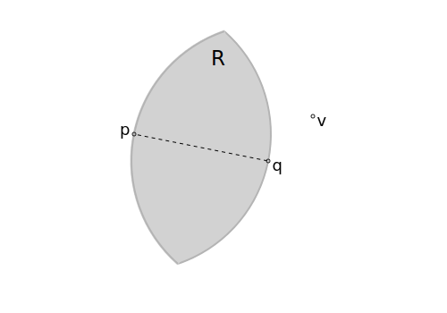

...
===

Consider a vertex set $V = \{ v | v \in \mathbb{R}^d \}$, $n = |V|$, where
we will be considering only $d \in \{2,3\}$ with a Euclidean distance metric.

Relative Neighborhood Graph (RNG)
---

The relative neighborhood graph, $\text{RNG}(V) = (V,E)$, is defined to be the
graph with sets of edges such that:

$$
\begin{array}{ll}
& (p,q) \in E \\
\to &
 \forall v \in V / \{p,q\}, \\
 & |p-q| \le \max( |p-v|, |q-v| )
\end{array}
$$

Take $p,q \in \mathbb{R}^d$, with $r _ {p,q} = |p-q|$.
Take the circle of radius $r _ {p,q}$ centered at $p$, $C _ p$,
and the circle of radius $r _ {p,q}$ centered at $q$, $C _ q$.
Call the intersection of the two circles, $R = C _ p \cap C _ q$,
the *lune* created by points $p,q$.

The relative neighborbood graph consists all edges, $(p,q)$, such
that there are no points in the lune between them.

In the illustration above, since $v$ is outside the lune region, $R$,
the edge, $(p,q)$,  is part of the relative neighborhood graph,
$(p,q) \in E$.

Elimination Heuristics
---

Consider $p,q \in V$, and the hyperplane with normal ${\bf N} _ {q,p} = (q-p) / |q-p|$ passing
through $q$.

Regardless of whether $(p,q)$ is in $E$, for any point, $v$, lying on
the other side of the half plane, $(p,v) \notin E$ (triangle inequality).
This means when trying to find which edges $p$ has, for any given $q$,
we can eliminate any point that lies on the other side of the half plane
from consideration to connect to $p$.

The heuristic is rough but easy to calculate.

