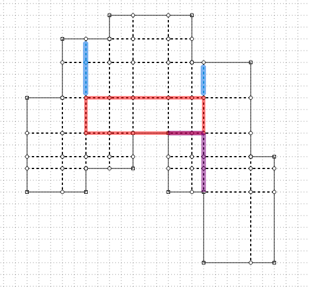
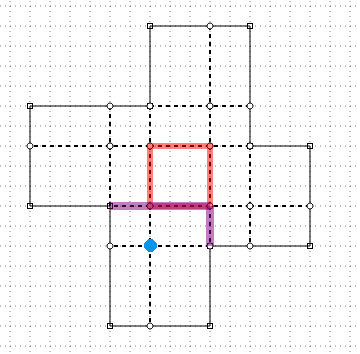

Rectangular Partitions of Rectilinear Polygons
===

I'm still trying to make sense of this but I think I might have a basic understanding now.

Consider a rectilinear polygon, $C = (c _ 0, c _ 1, c _ 2, \dots, c _ {n-1}), c _ k \in \mathbb{Z}^2$.

Call the induced *grid* as all intersecting points within the polygon from co-linear boundary edges extended.

That is:

$$
X = \{ x(c _ 0), x(c _ 1), \dots , x(c _ {n-1}) \} \\
Y = \{ y(c _ 0), y(c _ 1), \dots , y(c _ {n-1}) \} \\
G = \{ (x,y) | \forall x,y, x \in X, y \in Y, (x,y) \in \{ \mathsf{interior}(C) \cup \partial(C) \} \}
$$

Where $\mathsf{interior}(C)$ is the interior region of $C$ and $\partial(C)$ is the boundary.

We further label grid points, $p \in G$, as *interior*, *edge*, *indent corner*, *elbow corner* if
point $p$ is completely inside $C$, if it's on the edge of $C$ (only), if it's a reflex/concave edge of $C$ or
if it's a convex edge of $C$, respectively.
Here, "convex" and "concave" are relative to the interior.

A *line segment in/of $G$* is defined by two axis aligned endpoints in $G$.
A *maximal line segment in/of $G$* is a line segment such that has at least one endpoint in $C$, meaning
it has at least one endpoint that is a vertex defined in $C$.

---

From Lemma 5.1 of [Du,Ko,Hu]:

> There exists an optimal rectangular partition of $C$ in which each maximal line segment contains a vertex in $C$.

The proof is relatively straight forward and relies on two facts:

* If an interior line segment (of $G$) weren't maximal, it must have equal number of lines on one side as
  the other, otherwise we could nudge it towards one side and reduce objective function
* If an interior line segment weren't maximal and has equal incident lines on either side, then
  we can nudge it in either direction until it hits another line, reducing objective function

Both of these conditions show that interior (aka non-maximal) line segments can't be optimal.

Since every line is maximal, we have the Lemma.

---

There are only $O(n^2)$ maximal line segments.
Pairs of each of these maximal line segments can be chosen to split the original polygon in two.
A complete split of the polygon means that the two parts of the outer boundary, on a potential subset of $C$,
are contiguous.

On can choose an ordering of partitions such that only contiguous portions of the boundary $C$ are chosen.
Form this judicious ordering of partitions, it's possible to build up optimal solutions to sub partitions,
referenced by their boundary and cutting line segments (potentially not maximal?).
Calculation of sub problems and then re-using those calculations to build answers to optimal partitions
of larger sub-polygons allows for a dynamic programming approach, and thus a polynomial time solution.

The basic unit is the grid point, which informs how to choose the partition.
Choosing the grid point alone doesn't completely describe the partition as there might be some choice as to which
direction the maximal line shoots off from the grid point towards its connecting point on the boundary $C$.
There's only a few choices of directions for corner boundary cuts (4?), so this only acts as a constant factor
inflating the dynamic programming memoize array and doesn't change the order.

There are some further complications if the maximal line is straight, and not a corner, or if a maximal line
cuts off multiple regions (if there are "tabs" coming off the rectilinear polygon that would be cut off by a straight line, say).
These again don't change the order and are only special cases that need to be handled in a reasonable way.

I'm still a little shaky on the runtime and memory foot print as it seems like the basic index is the start and end
of contiguous boundary points on $C$ which would give $O(n^2)$ ($n = |C|$) but I'm surely missing something.

---

My initial implementation is going to be pretty inefficient.

Some terminology:

| Structure | Description |
|---|---|
| `C` | Original list of points describing the rectilinear polygon, in counter clockwise order |
| `Ct` | Matching array of corner types. `c` corner (convex relative inwards), `r` reflex (concave relative inward) |
| `G` | Array of grid points take from intersection of lines drawn out from reflex vertices |
| `Gt` | Matching array of grid point types. `c` original boundary point (corner or reflex), `b` point on boundary edge, `i` interior point |
| `X` | Array of x points from `C` |
| `Y` | Array of y points from `C` |
| `dualG` | 2D array of simple rectangles made of four (virtual) grid points, including inadmissible rectangles. Each entry has fields `ixy` x,y index, `G_idx` grid point index, `id` unique id (-1 if inadmissible), `R` four grid points that make up the dual rectangle |
| `G_idx_bp` | Map of x,y grid points to grid index. Key is comma separated string of x and y coordinates (e.g. `3,5`) |
| `Gv` | 2D array mapping 2D grid index to grid information. Each entry has fields `G_idx` grid index, `xy` two element array grid point, `t` type |
| `Gv_bp` | Map of x,y grid points to grid point index. Key is comma separated string of x and y coordinates (e.g. `3,5`) |
| `G_dual_map` | Map of x,y grid points to x,y index. Key is comma separated string of x and y coordinates (e.g. `3,5`) |

An overview is as follows:

* From `C` Construct the initial structures, most notably the grid points, `G`, and `dualG`
* Walk the boundary of `C`
  - for each reflex vertex, start a line, $L$
  - for each line direction
    + if it's an interior point, start a line, $S$, in the orthogonal direction and walk until a reflex or edge boundary point is hit and
      create two region boundaries, keyed on the list of dual rectangles within it
    + if it's a reflex or edge boundary point, create two region boundaries, keyed on the list of dual rectangles within it
* Once all regions are collected, deduplicate regions, note cost of guillotine or 2-cuts and mark rectangular regions as resolved
* While ...


---

Looks like there is a blog description of the algorithm ([here](https://nanoexplanations.wordpress.com/2011/12/16/polygon-rectangulation-part-3-minimum-length-rectangulation/)).

From the blog:

> Fact: It suffices to consider sub-figures whose boundary consists of a
> contiguous piece of the original boundary and at
> most two contiguous constructed lines.

Where, here, a *figure* is a 2D hole free rectilinear polygon.

We want to create sub-figures from an original figure.
Start with a figure without any constructed lines and consider the following method:

* If $F$ has no constructed lines, choose any vertex of $F$ (choose a **convex** point on the perimeter/boundary)
* If $F$ has a single constructed line (a Guillotine cut), choose either endpoint
  of the constructed line
* If $F$ has two constructed lines (a 2-cut), choose the point where the constructed
  lines meet

Call the candidate point $p _ F$.

For all grid points, consider valid points, $q$, that construct a rectangle entirely within $F$ (rectangle, fully within $F$ that has corners $p _ F$ and $q$).

So the algorithm works recursively on a (sub) region $F$ with a candidation point derived from two, one or none constructed lines passed along with it.
The *none* condition only happens at the root, where an initial point is chosen to kick off the recursion.

For a region $F$ and a candidate point $p _ F$, consider all grid points, $m _ k$, such that $R _ { p _ F, m _ k }$
(the rectangle made by $p _ F$ and $m _ k$) lies completely in $F$.
For each of the candidate points, take a bite out of $F$ with $R _ { p _ F, m _ k }$ and recur, choosing the new candidate
point appropriately (from the 1 or 2-cut partition used to create $R _ { p _ F, m _ k }$) and, when the recursion bubbles
back up, save the minimum value.

When starting from the full region, only one valid candidate point needs to be chosen as we know it has to be part of some minimum
rectangle and we loop through all possible rectangles with the candidate point.
The other points can be argued the same, where we recur/enumerate all possibilities with our subdivision scheme.

A superficial description is that a rectangular piece is chosen, then further rectangular pieces are cut, that share the
same corner as the previous, until the whole cake is removed.
Cutting each piece is only done from the stump of the last one and so keeps the contiguous boundary, eating away at it,
rectangular piece by rectangular piece.
At each step of the recursion, all rectangular pieces are chosen
but since it's only eating away at the boundary from the ends (aka keeping a contiguous boundary),
we know its polynomial time bounded.

It looks like Lingas et al. (and the blog post) suggest ordering by area, but I'm not sure if this is necessary or a "nice to have".
Lingas et al. have various methods to speed up matching point enumeration but these are effectively heuristics without
addressing the overall runtime.
Kim et al. use/refine Lingas et al.s heuristics and maybe give a tighter bound on runtime with it (?) but the "naive" algorithm
of enumerating all valid matching points provides an overall bound of $O(N^4)$.

---

I still don't understand how to implement this.

Here's a review:

* Every maximal cut line must have at least one end anchored on a reflex vertex
  - That is, there exists a minimum ink partition s.t. every maximal cut line has at least one reflex vertex anchor
  - Any maximal cut line that does not end on a reflex vertex is superfluous and can be removed
  - The other end of a maximal cut line can be another cut line, the boundary edge or a reflex vertex
* Every reflex vertex must have at least one cut line emanating from it. In the case of 2-cut lines emanating,
  each must have a reflex vertex at their other end

---

###### 2025-09-10

OK, I think I have a better understanding of how this algorithm works.

Kim, Lee and Ahn is a little terse to read but I think they provide a much clearer view of what's going on.

For a given figure (rectilinear polygon, potentially subdivided from the original), choose an origin point on
the boundary of the figure (details of which point to choose might be important, so more on this later).
This origin point, $\sigma$, must be part of a rectangle, so consider all grid points on the interior of the figure which
we'll call candidate points, $\rho$.

For each candidate point, $\rho$, try to construct a rectangle using $\sigma$ as the origin and $\rho$ as the corner points, where
the rectangle has non-zero area and lies completely inside the figure.
Call it $R _ { \sigma \rho }$.

The rectangle $R _ { \sigma \rho }$ will have some number of edges exposed to the interior of the figure (up to 4 potentially?).
For each of those edges, extend them in the appropriate directions so that they're maximal.
That is, each line has to have at least one endpoint on a reflex vertex, where the reflex vertex is from the original perimeter
of the rectilinear polygon.

The case analysis is going to be a bit hairy but the idea is that the number of combinations of maximal lines is finite.
Each of these choices will partition the sub-figure further, making progress at eating away at the perimeter of the original rectilinear
polygon.

If no rectangle exists with positive area, doesn't lie within the figure or has no choices for maximal edge cuts, reject it.

There's an implicit DP matrix here that has the start and end of the original rectilinear polygon, the grid point of where the
cut is and the choice of the cut lines (where their anchor is).
This gives a hand-waivy $O( N^3 )$ run-time.
I guess the size can be reduced but, at worst, the DP matrix is being filled out.

I don't think the actual choice of origin point matters too much but I think the suggestion is to use the candidate point from
the previous step as the new origin (and choose an arbitrary origin to start).

So, to summarize, choosing an origin point, $\sigma$, must have a rectangle containing it, so we look for all possibilities.
For each rectangle, we make sure to choose maximal cut lines that will reduce the perimeter.
Every rectangle that can't have it's edges extended into a maximal cut is invalid.
Since there must be a rectangle with the origin point and we've enumerated all possibilities of rectangle choices as well as the
choices for maximal cut lines, we've exhausted the possibility space to guarantee a solution.

###### 2025-09-17

From my understanding, the choice of origin point is inconsequential, from a worst case perspective.
The origin point ($\sigma$) might have a practical implication in run time but I don't think it matters
overall.

We might want to make sure to choose it in an ordered way (lex smallest, for example) but I don't think it matters.

The number of possibilities of maximal line segments to choose that will enclose the rectangle $R _ { \sigma \rho }$ is naively
bounded by $3^4 = 81$ (each line can be maximal left, maximal right or maximal both) but this is an overestimate as
there are only two possibilities for maximal line segments that are anchored by the origin point, $\rho$.
This puts the upper bound at 36 ($2^2 3^2 = 36$) and can be further lowered if the rectangle shares one or more edges with the boundary.

###### 2025-09-21

I think I finally understand this now.
There's still some specifics I need to understand but I think I have the basics.

Here is the key fact from the nanoexplantaions blog:

> It suffices to consider a region with an original contiguous boundary segment and at most two contiguous and
> connected constructed lines.

Kim et al. state this as well but not as clearly or explitily.

This leaves out some details, but I think they are:

* Given a region, $Q$, that has a contiguous original boundary and at most two constructed lines
* Consider an origin point $a$
  - If $Q$ is a 2-cut, $a$ is taken to the meeting point of the two constructed lines
  - If $Q$ is a 1-cut, $a$ is taken to be the endpoint of either end of the 1-cut
  - If $Q = P$, $a$ can be taken to be any bend point on the boundary
* Consider a matching point, $b$, in $Q$, such that $R _ { a,b }$ lies completely in $Q$
  - Use the short edges of $R _ {a,b}$ ( *billet* ) to extend its line segments to be maximal
  - This will create a certain number of partitions into sub-regions
  - Reject the matching point $b$, and thus the $R _ {a,b}$, if:
    + Any sub-regions is more than a 2-cut
    + Any sub-regions doesn't have a contiguous outer boundary
    + $R _ {a,b}$ is known to be non-minimal (has floating interior edges, etc)

A lot of the work in various papers goes on to show that only a certain subset of matching points
need to be considered, so the rejection is implicit by only considering known possible matching points
in the first place.

Kim et al. partition into 1, 2C and 2R cases, with 1 further partitioned into 1R and 1C.

For a 2-cut, the two constructed lines will be in-line with some portion of the boundary.
When the constructed lines are extended to include the boundary colinear line, you can then
extrapolate to create a kitty corner $\kappa$ point.

This $\kappa$ point creates a rectangle, $R _ {a, \kappa}$, not necessarily contained in $Q$.

If the two constructed lines create a reflex joint in $Q$, it's called 2R.
If the two constructed lines create an interior convex joint in $Q$, it's called 2C.
If there is only one constructed line, it's called either a 1, 1C or 1R, where 1C is when
it's not 1R and I'm not exactly sure what's considered a 1R.

The overall point is that since we're partitioning regions with only two constructed lines
and contiguous outer boundary, we now have a dynamic programming solution whose indices are the
indices of the contiguous boundary (so, two total) and whether it's interior/exterior (2R,2C,1, etc.).

### 2C

In $Q$, in the case of 2C, if the matching point, $b$, is in quadrent `III` from $R _ {a, \kappa}$
(so diagonal opposite), unless $R _ {a,b}$ shares a non-trivial edge with $Q$, this can never
be the case.
In this case, $R _ {a,b}$ will always have edges that are redundant.

Matching point $b$ can't be in quadrent `I` relative to $R _ {a, \kappa}$ (I believe) as this
would create a larger than 2-cut.

So the matching point, $b$, must be in quadrent `II` or `IV` relative to $R _ {a, \kappa}$.
I'm not sure there's much more optimization that can be done and these are the main areas
where matching points need to be considered.

### 2R

In $Q$, in the case of 2R, the claim is that no matching points $b$ can be within $R _ {a, \kappa}$.
This can be easily seen as any matching point, $b$, that extends the constructed line outward will
have the edge of the constructed rectangle, $R _ {a,b}$, to be redundant/moveable.
The exception is that if the rectangle, $R _ {a,b}$ shares an edge with the boundary $Q$.

Otherwise, any point outside of $R _ {a,\kappa}$ needs to be considered.

### 1

I have to think about this case a bit to see where the candidate point, $a$, can be chosen,
but I think these are simpler cases.

---


###### 2025-09-29

We have some new terms:

* *quarry (rectangle)* - rectangle chosen during the algorithm
  - *adit (vertex)* - $a$ grid vertex of quarry ($a$ grid vertex of rectangle chosen during algorithm)
  - *quarry corner vertex* - any of the four grid point corners that make up the the quarry rectangle
  - *bower vertex* - $b$ grid vertex, kitty corner opposite of $a$ within the (quarry) rectangle
* *billet (edge)* - side of quarry (side rectangle chosen during the algorithm)
* *cleave (line)* - a partition cut starting from a quarry vertex (a cleave must end at the original
  outer boundary) (if there are two cleaves in-line, with a middle billet joining them, it is possibile
  to combine them into a single cut)
* *clean cut* - if a (cleave) cut is a one or 2-cut of the subregion

Overall, we will choose an adit vertex and then choose a bower vertex.

The adit, $a$, and bower, $b$, vertex will create a quarry rectangle, $R _ {a, b}$ with four billet edges.
The billet edges might share none, some or all of their length with a previously constructed cut line
or the original boundary of the rectilinear polygon.

As a first attempt, we assume the adit, $a$, vertex is chosen
and loop through all bower, $b$, vertices to test the following:

* The quarry rectangle, $R _ {a,b}$, is completely in the current region $Q$ with positive area (no degenerate line $(a,b)$ )
* there is a choice of cleave lines from the quarry corner vertices that:
  - lie within $Q$ and not just on the edge or outside of it (that is, the direction of the cleave cut shoots into the body of $Q$).
  - isn't redundant by allowing a billet to slide between them
  - creates a one or 2-cut of the subregion

That is, if any cleave line creates a more than 2-cut (three cut or more), it can be rejected.

If a quarry rectangle, $R _ {a,b}$, is chosen, there are four corners to consider, each of which has, at most,
two cleave cuts that can come out of them.
Each cleave cut can exist or not, yielding an upper bound of $2^8$ possible cleave cuts.

Many of these can rejected before hand because the cleave cuts won't be in the considered region, $Q$,
or will be parallel to a neighboring cleave cut, implying a slideable billet.


Here's a first attempt at pseudo-code:

* Given: grid point $a$, region $Q$
* Foreach grid point, $b \in GP(Q)$:
  - if $(a,b)$ colinear, continue
  - if $R _ {a,b} \notin Q$, continue
  - Foreach cleave cut choice, $D = (d _ {\sigma(0)}, d  _ {\sigma(1)} , \dots, d _ {\sigma(k)} )$
    + if any of the cleave cuts start on the boundary of $Q$, continue
    + if any of the cleave start out of $Q$, continue
    + if there are two parallel cleave cuts in $D$, continue
    + if there is a cleave cut that doesn't create a one or 2-cut subregion of $Q$, continue
    + otherwise, recur on each subregion created from the cleave cut(s)

I think the major complexity is figuring out if the cleave cuts partition the subregions cleanly.

---

Thinking out loud:

Some more glossary terms:

* *interleaved boundary points* - grid points on the boundary that aren't part of the original boundary point description
* *primitive boundary points* - original boundary points
* *general boundary points* - all boundary points, including primitive and interleaved boundary points

A note on cleave cuts:

The cleave cut must not extend all the way.
It must go until it hits some boundary then terminate.
There are cases where extending the cleave cut will create a cut prematurely that might not be there.

A simple example is a cleave cut that goes to the left, runs into a border plateau that then goes to a pit then
eventaully terminates at a border.
If the edge of the pit would choose to be open, say with a cut upwards at the pit edge,
this would get missed by prematurely choosing the extended cleave cut.

```

 |   ?           |
 | ? *---*...*---*
 |   |   |   |   

```

The 2-cut property needs to be maintained and terminating the cleave cut at the first border still maintains that.
Whichever subsequent quarry rectangle or cleave cuts chosen will maintain the 2-cut property.

Moving on:

* Given two general boundary points, $p _ s$, $p _ t$, with the assumption that the outer boundary trace
  goes in counter clockwise order
  - call the region under question $Q$
  - The initial choise is on primitive boundary points
* For non colinear $(p _ s, p _ t)$, there are up to two choices for the joining point of the constructed lines
  - 0 index for first, which is lower in y (so lower left or lower right)
  - 1 index for second, which is upper y (upper right or upper left)
* For colinear $(p _ s, p _ t)$, there is a single cut line
* Choose an *adit* grid point, $a$:
  - For non colinear $(p _ s, p _ t)$, we enumerate $a$ at both endpoints of the two choices of where the constructed lines meet 
  - For colinear $(p _ s, p _ t)$, we enumerate two choices of $a$ at either end of the constructed line
  - Choose $a$ to be a primitive boundary point to bootstrap
* From $a$, choose a *bower* point $b$
  - $b$ must be within $Q$
  - The *quarry rectangle*, $R _ {a,b}$, must be wholly in $Q$
  - There are some other optimizations to further restrict $b$ and thus $R _ {a,b}$ which we'll ignore for now
* Call the constructed line(s) (alt. cut lines) defined by $p _ s$ and $p _ t$ as $\ell _ h$ for the horizontal and $\ell _ v$ for the vertical, if they exist (one must exist)
* Call the line segments of the quarry rectangle, $R _ {a,b}$ *billets*, labelled $\ell _ 0$ for the bottom, $\ell _ 1$ for the left,
  $\ell _ 2$ for the top and $\ell _ 3$ for the right
  - some or all of the billets will be part of either the outer boundary or the constructed lines $\ell _ h$, $\ell _ v$
* Call the four corners of the quarry rectangle $p _ 0, p _ 1, p _ 2, p _ 3$, representing the lower right, lower left, upper
  left and upper right corners respectively (each of the $p _ 0, p _ 1, p _ 2, p _ 2 \in GP(Q)$ )
* For quarry corner $p _ j$, $j \in \{0,1,2,3\}$,  consider potential cleave cuts $d _ {2j}$ and $d _ {2j + 1}$
* Choose all combinations of cleave cuts
  - Create a forced virtual $d _ k$ if its $p _ j$ is on a constructed line edge or a boundary edge (that isn't a corner)
  - In a particular combination, reject the combination if:
    + any $d _ k$ shoots off outside of $Q$
    + any $d _ k$ has a neighbor $d _ {k \pm 1 mod 8}$ parallel and chosen or forced (might need multiple passes)
    + any maximal $d _ k$ lines don't have at least one end on a convex primitive border vertex
  - The above is meant to enumerate all 1-cut or 2-cut scenarios
  - Implicitely, this should not create any 3 (or more) cut partitions but this should be verified
    (the parallel test should take care of it but I'm not confident)
* For each combination, record the rectangle cost, partition the remaining regions and recur
  - extend each cleave cut till the first time it hits the outer boundary (it should be impossible for a cleave cut to hit a constructed line)
  - the first place the cleave cut hits the outer boundary marks the start or end of the 1-cut or 2-cut subregion
  - walk the cleave cut in the opposite direction until it hits another cleave cut or an outer boundary, marking the intersection as the
    new adit point $a'$ for the subregion or as the corresponding start/end of the outer boundary for the new subregion
  - edges of the quarry rectangle need to be walked to see if they slice off any subregions by 1-cuts, adding the subregions to the queue
    with the start and end of the 1-cut slice

For the sake of clarity, the quarry rectangle $R _ {a,b}$ is not part of the 1-cut or 2-cut and is, in some sense,
chosen as the pivot region from where the remaining region is partitioned into 1-cuts or 2-cuts.

Billets will be moveable/redundant if the cleave cut is parallel to an edge or cleave cut not on a corner,
so this is what the parallel test is trying to capture.
If the parallel edge starts on a corner, the billet won't necessarily be redundant, so we need to be careful of this case.

Every adit point, $a$, must be part of a quarry rectangle in the final partition.
So, for example, if we have a 1-cut that has $a$ at one of its corners, there must be a bower point, $b$, that
can be chosen to create the rectangle.
In this case, the bower point, $b$, will be on the outer boundary and three of the the billets will be part of the outer boundary.

---

TODO:

* cadrp:
  - ~button to load from text input~
  - ~save border draws~
  - ~grab side of polygon to move~
  - ~1 or 2 cut mode to draw cut lines~
  - toggle Q area
  - ~quarry rectangle select~
  - cleave cut cycle
* implementation
* writeup


###### 2025-10-06


A note on picking cleave cuts from the quarry rectangle.

* If the cleave cut creates a region with more than three constructed lines, reject
* If the maximal constructed line containing the cleave cut doesn't end on a convex
  primitive boundary point, reject
* If the cleave cut would leave a constructed line floating, reject

One can easily see how a cleave cut could leave a three constructed line partition.

One can easily see how a cleave cut could not be on a maximal line that ends on a primitive boundary point.

It's a little harder to see but if you take the pinwheel configuration, you can see how you can create cleave
cuts that are embedded in maximal constructed lines that end on primitive boundary points but have a floating
constructed line.


---

Need to think out loud.

Start from full polygon, create auxilliary structures, specifically, G2d, B2d.

Taking 2-cut (or 1-cut) as two general boundary points, we have not only which direction
the joint is in but also which subregion to use.
I was thinking we could use just the order of the general boundary points to tell us
which joint it is, which can be done, but we still need an extra piece of information for
the subregion that we're recurring on.

So we should have a convention that the direction goes counter clockwise along the boundary,
with the cut at as the last 1 or 2 constructed lines.

For example, say we have start 5 and end 10 of 20.
This means a general boundary of (5,6,7,8,9,10).
If it were (10,5), this would mean a general boundary of (10,11,12,13,14,15,16,17,18,19,0,1,2,3,4,5).

We should have as additional key the position of the cut point (joining point of the 2-cuts) or none
if it's a guillotine cut.

For convenience, I guess choose the actual 2d point as the keys, so we don't need to mix-and-match
index types.

So the array is `DP[s_pnt][e_pnt][m_pnt]`, which a special `null` `m_pnt` for guillotine cuts.
By convention, since we traverse the boundary in counter clockwise order, this gives us a natural
way to describe which region we're working on.
Ordering the points in the other direction (`DP[e_pnt][s_pnt][m_pnt]`) indicates we're considering
the other sub-region.

We can translate between the start and end point by doing a lookup to the general boundary index.

Once we have a sub region as defined by the start, end and mid point (start/end on general boundary,
midpoint is one of the (internal) grid points), we can begin to process the sub region.

Processing the subregion begins with getting a list of adit ($a$) points (only 1 for convex or concave
2-cuts, a choice of two for guillotine cuts) that define one corner of the quarry rectangle.
We then loop through all possible grid points in the sub-region to test to see if it's a valid quarry
rectangle.

Testing the quarry rectangle for being completely enclosed can be done from our auxiliary structure
we've described above.

Once a candidate quarry rectangle is chosen, we enumerate all cleave cuts originating from corners
of the quarry rectangle.

For every choice of cleave cut, we extend outwards and then extend in the other direction, getting it's
endpoints.
If any of the cleave cuts don't end on primitive convex boundary, we reject the cleave cut choice.

For every choice of cleave cut, we extend outwards and then extend in the other direction, getting it's
endpoints.
If any of the cleave cuts don't end on primitive convex boundary, we reject the cleave cut choice.


###### 2025-10-08

I'm working through the details of choosing cleave cuts from the quarry rectangle.

Thinking out loud:

* For a 2-cut, adit $a$ will be at the intersection point between the two constructed lines
* For a 1-cut, adit $a$ will be one of $p _ s$ or $p _ e$
* We have 12 choices for cleave cuts
* We can mark each potential cleave cut as having it's first segment:
  - `x` out of bounds
  - `b` on a boundary
  - `c` on a constructed line
  - `.` inside grid (not on boundary or constructed line)
* `x` can be tested with the `Sx` and `Sy` structures
  - I think we have an auxiliary function that tests for line segement inclusion
* `b` can be tested by making sure it's inside and looking at the `B_2d` structure for both points having
  no more than 1 index difference
* `c` ...

For the `c` case, here are some example pictures:

| | |
|---|---|
|  |  |
  

We're trying to determine if our rooted ray cleave cut is on a constructed
line or inside the grid, where we assume we've already tested for out of bounds (`x`)
and whether it's on the boundary (`b`).

Consider a point on the primitive boundary $p _ b$, the adit point $a$, cleave cut root $p _ c$,
and cleave cut direction $d _ k$.

* If $\delta(p _ b - a) \ne \delta(d _ k)$, the cleave is not in-line with the constructed line $(a, p _ b)$
* Else if $p _ c = a$, the cleave cut is on the constructed line $(a, p _ b)$ (`c`)
* Else if $\delta( p _ c - a ) = d _ k$, the cleave cut is on the constructed line $(a, p _ b)$ (`c`)

So, orthogonal test, root test, in line test.
If $d _ k$ is not in-line with either of the two constructed lines, the it must be internal (`.`).

###### 2025-10-10

I'm still fussing with figuring out on how to validate a cleave realization.

So far, for adit $a$, bower $b$, quarry $R$, an a cleave candidate vector ( $\gamma \in \\{\text{x}, \text{b}, \text{c}, \text{.}\\}^8$ ):

* reject if a cleave ray starts on flat edge and ends on flat edge (**bridge**)
* reject if a cleave ray's maximal line does not end on at least one convex primitive border point (**float**)
* reject if a cleave ray is parallel to another cleave ray, constructed edge or boundary edge (so any parallel edge) (**parallel**)

Some example pictures:

| bridge | float | parallel |
|---|---|---|
|  |  |  |

One of the candidate cleave points should be rejected if its not in the region under consideration:

| |
|---|
|  |

I'm fussing with how to do this test well.

... The cleave ray is part of a 2-cut.
If it's not, we reject to begin with.
If the 2-cut has it's partition in the boundary range outside of our current region, we can reject.

So, follow the cleave ray to the boundary and get the general boundary point index.
If the index falls outside of the current general boundary index range we're working on, reject.

Or just initially follow each ray until it hits the general boundary point, and mark it appropriately
if it falls outside the current region.

With the auxiliary rectangle testing structures, this can be made to be $O(\log n)$ but initially we'll
just use the simple grid point walk ( $O(n)$ ).

---

So, here's a recap:

* We're only considering a 2-cut with two constructed lines right now
* For a 2-cut with adit point $a$, bower point $b$ and quarry rectangle $R _ {a,b}$
* Construct the cleave candidate vector with `x` for out of bounds, `b` for boundary edge,
  `c` for constructed line edge and `.` for interior grid point
  - follow each rooted cleave ray to the first general boundary point, marking the position
    as `x` if the intersecting general boundary point is out of the current boundary range
* Enumerate all possible cleave cuts for positions in the clave candidate vector that are `.` (interior points)
  - reject if a quarry rectangle corner has two `.` positions and there isn't at least one cleave cut
    occupying it
  - reject if cleave cut starts on a flat edge and ends on a flat edge
  - reject if the maximal edge the cleave cut sits in doesn't have at least one primitive convex border intersection
  - reject if cleave cut is parallel to an edge
    + if the parallel edge is a another cleave cut or a constructed edge (part of the original 2-cut), then this represents
      a 3-cut
    + if the parallel edge is a border, then the billet between them is floating

I don't think much changes with a guillotine cut, but this needs confirmation.

---

We want efficient cleave to boundary lookups.
A naive algorithm would walk the grid until it hits the boundary.
This works but has the potential to be slow, being effecitvely and $O(n^2)$ operation,
depending on how many grid points are in line.

The `Sx` and `Sy` structures exist (sum of contiguous interior regions from left-to-right and bottom-to-top)
but:

* To calculate maximum boundary, binary search needs to be used
* Linear search still needs to be used for closest boundary point

The `Sx` and `Sy` structures almost get us there but they only give us the sum and so we know we have to have
something else to give us the choice between the nearest and furthest boundary point.

We can just save the boundary point from each grid point and direction directly.
We need to traverse the whole grid to begin with, so we can do an extra pass to save
the information that we want.

The idea is to create two extra structures, `Je` and `Js`, each a 3d array with
the first dimension the `idir`, the second, the y index coordinate and the third the x index
coordinate.

`Js` will hold the *first* boundary point, in the cleave direction, on an orthogonal boundary line to the cleave direction,
not including the starting point.
`Je` will hold the *last* boundary point, in the cleave direction, on an orthogonal boundary line to the cleave direction,
not including the starting point.

In other words, shoot a ray out from the point in the cleave direction.
Walk the ray until it hits a boundary point that has an edge orthogonal to the cleave direction.
For the `Js` structure, catalogue the first time that happens, for the `Je` structure, catalogue
the last time that happens.

Figure on the left is `Js` and figure on the right is `Je`:

| | |
|---|---|
|  |  |


Numbers in yellow represent the index of the general boundary point and numbers in red represent the
first general boundary point intersection in the appropriate `idir`.

With `Je` and `Js`, we precompute the values to get an $O(1)$ test to find the internal boundary intersection point.
Testing to see if the billet is on the boundary, on the interior, etc. might need to be done with
other structures, such as the `B_2d` or `Sx,Sy` structures, so we might want to keep the `Sx` and `Sy` structures.

The specifics are involved but the idea is to sweep from one side to another, keeping
track of whether we're interior or not.
If we continue to be in the interior, keep track of the far boundary, updating the near
boundary as necessary.
As we walk the points, update with the appropriate value.

The trick comes from understanding when to update the transition from interior to exterior.
I think looking at neighboring boundary points, if we encounter a boundary point during our
walk, will suffice, but we'll see.

---

###### 2025-10-20

More thinking out loud.

Create a function that takes in two general boundary points, the order of which determine the region in question,
an adit point, $a$, that is either the intersection of the 2-cut made from two constructed line cuts from the boundary or is on either
side of a single 1-cut, and a bower point, $b$, that marks the edge of the rectangle.

Either it's assumed adit $a$ is on the corner of the 2-cut or on the one side of the 1-cut and that $b$ is within the region or these checks
can be made.

The function will then cycle through the cleave cuts, checking for validity, but otherwise return a list of candidate cleave cuts
that will partition the remaining region into 2-cut or 1-cut regions.


My current tactic will be to try to first get a cleave profile that tells us which can be rejected outright.


###### 2025-11-09

Up to some more verification, I think all the components are now in place to implement the core of the algorithm.

Here's a sketch:

```
    |  MIRP(ctx, b_0, b_1, g_a):
    |
    |    if ctx.memoize(b_0, b_1, g_a) !== undefined:
    |      return ctx.memoize(b_0, b_1, g_a)
    |
    |    cost = \infty
    |
(gp)|    for g_b in G:
    |      if Q = Quarry(g_a,g_b) \notin R: continue
    |      c = ink(Q)
    |
(1c)|      for one_cut in enumerateOneCut(ctx, b_0, b_1, g_a, g_b)
    |        c += MIRP(ctx, one_cut.b_0, one_cut.b_1, one_cut.g_a)
    |     
(2c)|      for two_cut in enumerateTwoCut(ctx, b_0, b_1, g_a, g_b)
    |        c2 = MIRP(ctx, two_cut.b_0, two_cut.b_1, two_cut.g_a)
    |        if (c + c2) < cost: cost = c + c2
    |
    |      if cost == \infty: cost = c
    |
    |    ctx.memoize(b_0, b_1, g_a) = cost
    |    return cost
```

Line `(gp)` will be $O(n^2)$, line `(1c)` will be $O(n)$, line `(2c)` will be $O(1)$.
`ctx.memoize` has $O(n^4)$ entries, so that provides an upper bound on run-time and space.


###### 2025-11-11

I've settled on a more standard way of representing data and refactored.

There are now three main structures:

* $B$ - the general border structures
* $G$ - the grid points
* $J _ s$ - the border jump structures

The `[BG]t` hold a character 'type' code of what point it is, the `[BG]xy` map the index to
world coordinates, the `[BG]ij` are 2d arrays that map the `i,j` grid coordinates to an index
and the `[BG]` arrays map index to `i,j` grid points.

For consistency it should probably be `[BG]ij` that map index to `i,j` with the `[BG]` as 2d
arrays that map to index, but that's how it's set up for now.

The $J _ s$ structure holds four 2d arrays, one for each `idir`, that map grid points to the
first general border index point in the cardinal direction.

All 2d arrays have column first so are accessed e.g. `B[j][i]`.

Two auxiliary structures:

* $C$ - the original (primitive) border points and types
* $X$, $Y$ - arrays that that hold the real world $x$ and $y$ coordinates

###### 2025-11-17

I'm a little nervouse about some of the case analysis.

One issue is when there's a potential cleave cut but the other corner is a border point.
See ( $g _ s = (2,5), g _ e = (3,6), g _ a = (2,6), g _ b = (6,3)$ ), where the cleave
cut goes down at $(6,3)$:

| |
|---|
|  |

Some things to note:

* If there's a quarry corner with a potential cleave (open) with the other quarry corner a border,
  it must be an inside corner
* If there's a potential cleave, it must terminate at an interior corner ( $(6,3)$ in the picture).
* If it's to be picked up by the cleave enumeration, the quarry corner on the other side must
  have two open cleave positions
  - if none, then it would be picked up by side quarry enumeration
  - if one the first direction (down), then again side quarry enumeration
  - if one in the other direction (left), then the cleave down is possible but
    would still be possible in the sub-region during the recursion
  - if two, then again picked up by side quarry enumeration

So I think we've convinced ourselves that during a cleave enumeration, if there's a quarry
corner with one border cleave and one open cleave, the open cleave shouldn't be enumerated.
It'll either remain open or be picked up by the recursion.


###### 2025-11-18

Guillotine cuts will have to be treated separately.
The adit point can be chosen as either end of the guillotine cut, so batching them into
a single cut to be processed in the MIRP recursion will lead to a combinatorial explosion.

Further, I've flubbed the order on some of the cut function, in particular the quarry side region,
so this will need to be made more consistent.

During the MIRP recursion, determining whether it's a valid quarry rectangle leaks into finding
the cleave cuts and such.
For example, a cleave profile of `bxbxXXXb` is invalid as there's a bridge side of the quarry rectangle
(rightmost edge) but this had been passing the `...valid_R` and snuck past the other enumerations.

That one in particular, even though it's an invalid quarry, fails to create the appropriate side cuts,
which I'll need to investigate further.

Summary:

* MIRP needs to consider guillotine cuts independently instead of grouping them, and then recur
  on *two* choices for the adit point, at either end of the guillotine cut
* review order from side cut function and others to make sure the cuts it's giving are consistent
* at least think about how to determine whether a quarry rectangle is valid and account for the
  abstraction leak to back out if it's determined the quarry rectangle is invalid later
* ~fix or review the side cut function to figure out if/why it's not giving cuts under some conditions
  (potential bug)~
  - fixed (hopefully):
    + fenced region check was invalid
    + need to make sure orientation of source cut is correct

---

I'm fussing with a condition in `CleaveProfile` where there are parallel `b` quarry
endpoints.
I think maybe letting these through might be ok.

Consider a straight well down, then it's clear the constructed edge that bridges them is redundant.
But if the well isn't a well, but a foot, with a cavity beneath, then there are two options.
You don't know whether the bridge cleave cut would be valid without looking ahead.

This only applies if at least one of the `b` end points is a corner.
If they're both true `b` flat points, then it's clear the guillotine cut would be redundant.

---

There's some subtlety in how to do the recursion so we don't get into an infinite loop.
The current version has a bug where this happens.

The bug is as follows:

* There's a 1-cut, partitioning off an upper region
* In the upper region, we start looking for a quarry rectangle
* One choice is choose the adit point on the right most 1-cut endpoint
  and start by looking at bower points to the right
* There's a bower point found, with a 1-cut to the left
* Now the recursion has a 1-cut to the left where it didn't come from
* stack overflow

This can be seen in a `z` polygon.

There are bower points excluded by the Ahn paper which I mostly ignored because I either considered
them as optimizations or because I hoped they would be caught by the cleave enumeration.
It looks like they might be necessary in making sure the recursion works correctly.

These are from *Lemma 3*:

* For a $2C$ cut with adit $a$, kitty-corner rectangle $R _ {a, \kappa}$, either the bower point $b \notin R _ {a, \kappa}$ 
  or the quarry rectangle $R _ {a,b}$ shares a non-degenerate boundary with $\partial P$
* For a $2R$ cut with adit $a$, kitty-corner point $\kappa$, then either the bower point $b$ isn't in quadrent `I` or `III`
  of origin $a$ relative to $\kappa$ or the quarry rectangle $R _ {a,b}$ shares a non-degenerate boundary with
  $\partial P$
* For a 1-cut with adit $a$ and bower $b$, the quarry rectangle $R _ {a,b}$ shares a non-degenerate boundary with the cut

The first condition isn't handled but I don't think this does anything other than create more work by recurring
on sub-optimal solutions.

The second condition is handled by the cleave cut enumeration.

The third condition isn't handled and is causing the stack overflow.
The fix should be to add an additional check in the `QuarryInfo` function to notice when the adit and bower point
are in-line and to exclude bower points that are too far to the left or right of the 1-cut line segment.

###### 2025-11-22

I've hacked together some extra tests for the two-cut enumeration.
I'm not sure they're correct but the idea is:

* Take a candidate cleave enumeration, `cc` (8 total potential cleave cuts)
* For each cleave of `cc`, if it's even, add the counterclockwise two-cut,
  if it's odd, take the clockwise two-cut
* Look in the opposite direction to see if there's a neighboring cleave cut and,
  if so, add that two-cut
* If not, there's a potential 1-cut:
  - if there's no cleave cut two cleave indices away and the cleave direction
    three indices away doesn't spill over into the non-considered region
  - OR there's a border buffetting the side of the quarry rectangle
  - THEN it's a one cut and add it

I don't know how to avoid this special case nightmare.

---

When recurring on one-cuts, it gets worse than considering either side of the constructed
line partition as the quarry rectangle side can be larger than the partition line.
See Figure 5. in Kim et al.'s paper.

Here is an example that illustrates the issue, assuming the start of the recursion happens
at `[2,0]`:

| |
|---|
|  |

The one-cut from `[4,2]` to `[3,2]` (general border index `(12,3)`) needs to choose a quarry rectangle
from `[1,2]` to `[6,3]`, say, in order to be optimal.

From Ahn et al. it looks like O'Rourke and Tewari threw up their hands and settled on $O(n^5)$ (though
maybe this is because they're using "thick" partitions, aka t-partitions), which comes from
trying all combinations of adit and bower points for the quarry rectangle that share a non-degnerate
line segment with the one-cut ( $O(n)$ adit points in-line with the cut, $O(n^4)$ bower grid points).

It looks like Ahn et al. bound the number of sub-polygons (potential quarry rectangles?) by $O(n^3)$,
staying under their global $O(n^3)$ run-time goal (Section 4.1.3, Lemmas 9, 10, 11, 12).


References
---

* ["Rectangular Partitions of a Rectilinear Polygon" by Kim, Lee, Ahn](https://arxiv.org/pdf/2111.01970)
* ["Minimum Edge Length Partitioning of Rectilinear Polygons" by Lingas, Pinter, Rivest, Shamir](https://people.csail.mit.edu/rivest/pubs/LPRS82.pdf)
* ["Design and Analysis of Approxmiation Algorithms" by Du, Ko, Hu](https://link.springer.com/book/10.1007/978-1-4614-1701-9)
* ["The Structure of Optimal Partitions of Orthogonal Polygons into Fat Rectangles Rectangles" by O'Rourke, Tewari](https://scholarworks.smith.edu/cgi/viewcontent.cgi?article=1200&context=csc_facpubs)
* ["Polygon rectangulation, part 3: Minimum-length rectangulation", Nanoexplanations, blog of Aaron Sterling](https://nanoexplanations.wordpress.com/2011/12/16/polygon-rectangulation-part-3-minimum-length-rectangulation/)


