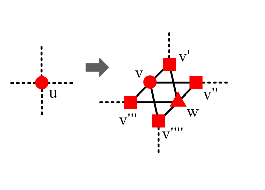
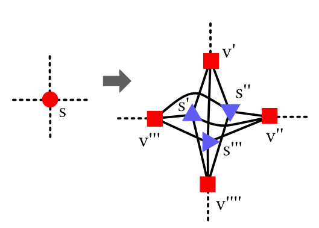

s-t Hamiltonian Path Notes
===


###### 2025-07-13

Lemma 8 from the paper, Lemma 7.1 from the thesis. In words:

$G$ has no type `III` boundary cells, $s$ an even alternating strip,
$G ^ { - } _ { F }$ the dual graph without $F$ crossing edges,
$x,y \in G ^ { - } _ { F }$ not in corresponding cells derived from $s$ (call it $s'$.

If there's a path, $p$, from $x$ to $y$ in $G ^ { - } _ { F }$, then there's
a path, $p'$, from $x$ to $y$ in $G ^ { - } _ { F \oplus s }$ (graph after alternating
strip $s$ applied). And vice versa.

Further, if $v \in p$ that isn't in $s'$ then $v \in p'$.

In other words, there's some notion of connectivity that remains unaltered when we
start flipping even alternating strips.

Uman's thesis (Lemma 7.1) has a proof.
I'm going to punt on this till later, but it looks like it's looking at the start of the
even alternating strip, $s$, and seeing what happens to it's connectivity.
The proof claims $s$ starts on a type `I` boundary cell, which may be obvious but
I'm not seeing why it has to be a boundary cell.

Since type `III` is precluded, flipping edges, forces some configuration which can be
deduced as connected still.
Again, I'm not going into it, just placing a guidepost for future reference.

---


###### 2025-07-12


I'm going skip ahead to section 4 to try and get an overview of the algorithm
to motivate some of the earlier Lemmas instead of working through the Lemmas, unmotivated,
to section 4.

Section 4 starts by describing *static alternating strips*.
The first paragraph in this section might understate the problem a bit but,
without being able to find a static alternating structure, there might be
an exponential blowup in search cost moving through non-static alternating
strip choices (Uman's thesis, pg. 48: 'An efficient algorithm that identifies
alternating strip sequences must be able to identify the entire sequence in
the graph "statitcally"; otherwise, a search of candidate seuquences might quickly become exponential.").

> A *static alternating strip sequence*, $A = (a _ 0, a _ 1, a _ 2 , \dots , a _ {n-1})$,
> has each $a _ i$ area disjoint, with the only shared edge allowed between two
> strips $a _ i$, $a _ {i+1}$ is the last edge side edge in $a _ i$ and the first
> side edge in $a _ {i+1}$.

Here is a graphic:

```
              a_i
 
 * . *---* . *---*      . *---* . *---*
 |   '   |   '   |  ooo   '   |   ' e '
 * . *---* . *---*      . *---* . *---*---* . *---* .
                                  |   '   |   '   |   ooo
                                  * . *---* . *---* .

                                          a_{i+1}
```

As a reminder, as soon as we see an odd strip, we can make progress, so
these sequence of strips start out with even strips.


###### 2025-07-10

Continuing on with finding Hamiltonian cycles in solid grid graphs (UL97).

To recap:

* Add widgets and do perfect edge matching to get initial 2-factor
* Have shown alternating strips either make progress (odd) or leave
  number of 2-factor components unchanged (even)
* Have shown that creating alternating strip sequences, if it can be done,
  always makes progress (strip sequences are runs of even that end in odd)
* Need to show that:
  - alternating strip sequences can always be found (if they exist)
  - can be found in polynomial time

The main theorem is Theorem 5:

> There exists an alternating strip sequence in a Hamiltonian $G$
> with a 2-factor with more than one component.

Where the alternating strip sequence is relative to the 2-factor, $F$, in $G$
($G$ a solid grid grid graph in 2d).

From section 3:

> Our strategy ... show that any 2-factor $F$ can be transfomred into any other
> by flipping a set of cycle in $G$ that alternate with respect to $F$.

From the overview:

* will show set of cycles that transform (flip?) $F$  must cross boundary
* at least one cycle must cross boundary
* cycle will walk along some portion of the boundary to land at the beginning
  of an alternating strip (that begins at the boundary point)
* flipping this alternatings strip will bring $F$ closer to the Hamiltonian
  cycle $H$

The dependency graph is needed for the cell-to-cell walk and distance measure ($F$ to $H$).

---

Define:

* Cycles are *nested* if they are edge-disjoint (but not necessarily vertex disjoint?)
  and all interior faces of one are interior faces of the other.
* Cycles *cross* if they are edge-disjoint (but not necessarily vertex disjoint?)
  if they aren't nested but share an interior face
* The *area* is the number of faces (cells) it encloses


Example of a *nested* cycle:

```
  *---*---*---*         *---*---*
  |   '   '   |         |   '   |
  * . *---* . *         * . *~~~*---*
  |   |   |   |         |   (   )   |
  * . *---* . *         * . *~~~*---*
  |   '   '   |         |   '   |
  *---*---*---*         *---*---*
  
```

Where the interior nested cycle is the one with `~` and `(`, `)`.
The left outer area is 9, with the left inner nested cycle area of 1.
The right outer area is 7 with the right inner nested cycle area of 1.

Example of *crossed* cycles:

```
  *---*---*
  |   '   |
  * . *~~~*~~~*
  |   (   |   )
  * . *~~~*~~~*
  |   '   |
  *---*---*
  
```

Where one of the cycles is the one with the `~`, `(` and `)`.
The bigger cycle area is 6 with the smaller cycle area of 2.

Lemma 6:

> $F _ 1$ and $F _ 2$ be 2-factors of $G$ with $S = F _ 1 \oplus F _ 2$.
> $S$ can be partitioned into edge-disjoint non-crossing cycles that alternate with respet to $F _ 1$

I guess we're ignoring when $F _ 1$ and $F _ 2$ completely overlap?
The above seems completely false if $F _ 1 = F _ 2$ and the following statement is just plain false:

> Figure 6 shows the possible edge configurations around each vertex in $S$

nope. It doesn't show the vertex configuration when the edge line up completely.

Enumerating permutations as listed in the paper:

```
      *               *               *
      |               (               '
  *---* . *   +   * . *~~~*  =>   *---*~~~*
      '               '               '
      *               *               *


      *               *               *
      |               '               |
  *---* . *   +   * . *~~~*  =>   *---*~~~*
      '               )               )
      *               *               *

      *               *               *
      '               (               (
  *---*---*   +   * . * . *  =>   *---*~~~*
      '               )               )
      *               *               *

```

The point being that each vertex in the resulting graph has even degree,
though they seem to discount the 0 degree case for some reason.

OK, so upon further reflection (and some helpful coaching by Copilot)
I understand this a bit more.

Yes, there are 0 degrees when $F _ 1$ and $F _ 2$ line up but
this is a degenerate case and makes Lemma 6 vacuously true.

The more interesting case is when $F _ 1 \ne F _ 2$. In this case,
the enumeration of states is as listed above.
All vertices are of even degree, so as soon as you have one vertex
joined with another, it must have an escape.
That is, an edge goes in, we either have 1 or 3 choices out (1 or
2 if we're trying to alternate parity).

Further, if the edge comes from $F _ 1$ then there must be an
$F _ 2$ escape out of it.
This means we can always choose an alternating sequence.
If choose a new vertex to go to, we continue on without traversing
an edge we've already seen.
If we come back to a vertex we've already visited, we tie it off and create a
cycle.
Since, again, all degrees are even, and we're traversing in alternating
choices of edges (in $S$) that come from $F _ 1$ and $F _ 1$, we've chosen
an alternating cycle.

This argument doesn't preclude crossing.
To see that we can choose non-crossing cycles, we take a look at
the last two cases of degree 4 with two edges from $F _ 1$ and two
edges in $F _ 2$.

---

*aside* a quick thought I had was that one of the reasons why these proofs might
work for solid grid graphs, as opposed to arbitrary grid graphs, is that they
rely on the region under consideration having no holes.
Whenever an alternating strip, or a contour, or whatever else, needs to be chosen,
they need to know it can be shrunk, that there's no other path, etc.
These assumptions, whether they're explicit or implicit, may rely on some connectivity,
simple connectivity and, maybe, some type of Green's or Jordan curve theorem (or analogy
thereof).

It'd be interesting to see under what conditions these lemmas fail to hold with
holes.

---

To show $S$ can be partitioned into edge disjoint non-crossing cycles, I'll paraphrase
Uman and Lenhart:

* Proof by contradiction.
* Assume $S$ of minimal area.
* Take a cycle, $C \in S$, with a crossing.
* If there's an internal path $p'$, in $C$, it must happen at two degree 4 vertices, $u$, $v$,
  one to enter, one to leave (path $p'$ is internal to $C$ and connects to boundaries)
* The path $p'$ can be chosen alternating (w.r.t. $F _ 1$) and we know that $u$, $v$
  have an alternating edge choice to connect the path.
* But now path $p'$ can be chosen as the boundary edge for $C$, making the area strictly smaller,
  contradicting our claim of minimal area

This concludes the proof of Lemma 6.

---

### Dependency Graph

I'm still working through this but here's my current understanding of what's going on:

* The dependency graph (DG) is essentially a dual lattice graph overlaid on the underlying solid grid graph
* The dependency graph is directed, so the edges between nodes in the DG have direction (nodes in DG are faces in
  the original solid grid graph)
* Parity is still an issue so the DG is constructed with with edges that depend on the parity of the DG's vertices
* Following the edges in $G$, the original solid grid graph, or some derived cycle/path therein, choosing direction in $G$ along
  the DG along a 'countour line', where the directed edges have the same direction, gives information about
  what kind of alternating cycles we can find/construct (this is to be proved, I don't understand why this is the case yet)
  - That is, we can follow a $S$, say, keeping the DG directional edges to one side
  - In some sense, the DG is like a gradient vector field that we can create appropriate contours

Section 3.2 defines $E _ V(F)$ and $E _ H(F)$:

* $E _ H$ - horizontal edge sets
* $E _ V$ - vertical edge sets
* $F$ - (some) 2-factor of $G$

$$
\begin{array}{ll}
E _ 0 (F) & = \{ e | e \in E _ H \cap e \in F \} \cup  \{ e | e \in E _ V \cap e \notin F \} \\
E _ 1 (F) & = \{ e | e \in E _ V \cap e \in F \} \cup  \{ e | e \in E _ H \cap e \notin F \} \\
\end{array}
$$

In words:

$E _ 0$ are all edges that appear horizontally in $F$ and *don't* appear vertically in $F$.
$E _ 1$ are all edges that apper vertically in $F$ and *don't* appear horizontally in $F$.

* $G ^ { * }$ be the dual of the graph $G$ (a new vertex for every face, new verticies have edges
if faces in $G$ Manhattan adjacent).
* $G ^ { + }$ be $G ^ { * }$ with the addition of a single vertex border (aka "dilation").
* $V _ 0 \cup V _ 1 = V ( G ^ { + } )$, $V _ 0 \cap V _ 1 = \emptyset$ ($V _ 0$, $V _ 1$, a bi-partition or coloring)

Definition 3:

> G ^ { + } _ {F} is the *dependency graph* for $G$ with respect to $F$,
> such that $(u,v) \in E( G ^ { + } _ {F})$ iff $u \in V _ k$ and
> $(u,v)$ crosses some $e \in E _ k (F)$ for $k \in \{1,2\}$

$V _ 0$, $V _ 1$ partition the vertices of $G ^ { + }$ and $E _ 0(F)$, $E _ 1(F)$ partition the edge set
of $G$, so there will always be a unique edge between $u,v \in G ^{ + } _ F$

Lemma 7:

> A cycle $C$ in $G$ alternates w.r.t. $F$ iff every edge in $G ^ { + } _ { F }$ that
> crosses $C$ is directed to the interior of $C$.

A moments reflection on traversing $C$ will reveal this to be true (enumeration of cases).

Note that this doesn't really say how to choose $C$, only that once $C$ is chosen, this is a property of it.
One can start to try to construct a $C$ and get into a dead end.


###### 2025-07-09

Finding Hamiltonian cycles in solid grid graphs (and quad-quad graphs) is polynomial time solvable [10.1109/SFCS.1997.646138](https://ieeexplore.ieee.org/document/646138).

I'm still working through the algorithm but the idea is to start from a list of disjoint cycles in the solid grid graph (called a 2-factor),
then progressively merge until a full cycle is created or no more progress can be made.

The Umans and Lenhart paper glosses over the details of finding the initial 2-factor.
Umans bachelors thesis goes into more detail and here are some notes on that process.

Umans provides two ways to find an initial 2-factor.
The first is to create a linear programming problem with each edge assigned to a variable, $x _ i \in E(G)$ ($n = |E(G)|$)  with $0 \le x _ i \le 1$ for all $0 \le i < n$.
The objective function attempts to maximize the number of edges subject to the degree requirement, for each $x _ i$, $\sum _ {x _ i \in E(G)} x _ i \le 2$.

The maximum value of this LP problem happens to be integral and I guess Bridgeman's bachelors thesis provides more detail on proof of correctness.

Uman goes on to create a perfect edge matching construction to find the 2-factor.

An edge matching on a graph $G$ is an edge partition such that every vertex is included exactly once for one of the edge partitions.
A perfect edge matching is an edge matching that contains the largets possilbe $|E(G)|/2$ edges (which is only possible for even number of vertices).


Uman's construction essentially adds a widget that forces degree two at each vertex and then uses standard methods (Ford Fulkerson, etc.) to find
a perfect matching.

Call the original (solid, grid) graph $G$ and the induced graph $G _ { w }$.
For all $u _ k \in G$, create a new vertex  $v _ k \in G _ { w }$  create two new vertices per edge, $v _ { u _ k , u _ j}, v _ { u _ j, u _ k } \in G _ { w }$
for all $(u _ k, u _ j) \in G$.
Create edges $(v _ k, v _ { u _ k, u _ j })$, $(v _ j, v _ {u _ j, u _ k})$ and $( v _ { u _ k, u _ j }, v _ {u _ j, u _ k} )$.

Introduce one more vertex per $w _ k$ and connect $w _ k$ to all neighbors of $v _ k$ (so each $w _ k$ will have maximum degree 4).

A perfect matching on these widgets in $G _ { w }$ force each vertex to have degree 2 in the original graph $G$.

This graphic might be helpful:



Where the circle on the left represents the original vertex ($u _ k$) and the widget on the right represents the transformation,
with the circle going the newly created $v _ k$, the squares being the $v _ { u _ k, u _ j}$ and the triangle being the extra $w _ k$ vertex.

A moments reflection will show that any perfect edge matching forces exactly two of the $v _ { u _ k, u _ j }$ to have edges that connect
to a vertex induced from the original neighbor graph, with $w _ k$ absorbing the perfect matching edges for the other two induced edges
not used.
It's complicated to describe but the idea is that the perfect edge matching induces a 2-factor encoded in the induced graph edge matching
and that's easily recoverable into the original desired 2-factor.

To find a perfect edge matching, as mentioned above, LP can be used. Another option is to do max-flow-min-cut (Ford Fulkerson)
since the induced graph ($G _ { w }$ is bipartite.
Quickly, put weights $1$ on each edge, push one partition of the bipartite to the left, the other to the right and connect a source node
to all left nodes and a sink node to all right nodes with each new edge weighted $1$ then use max-flow min-cut to find the flow.
All interior edges that have a flow imply an edge between the vertices.

FF does an augmenting path in $O(E)$ and makes at least $1$ unit of progress.
There are $O(V)$ vertices, so $O(V)$ maximum flow, yielding $O(V E)$.

---

Once an initial 2-factor is found, Uman's algorithm proceeds to merge paths.

Some preliminaries:

Consider a 2-factor (Fig. 2):

```
     *---*---*---*---* . *---*---*
     |   '   '   '   |III*   '   |
     *---* . *---*---* . *---* . *
     ' II|   | II.III.IV '   |   |
 *---* . *---* . *---* . *---* . *
 |   | II. I ' II|   |III|   '   |
 * . *---* . *---* . * . *---*---*
 |   '   |   |   '   |
 *---* . *---* . *---*
     |   '   '   |
     *---*---*---*

```

All cells labelled `I`, `II`, `III` and `IV` are called *boundary cells*.
I think the idea is that the 2-factor separates 'interior' and 'exterior'
and boundary cells lay on the 'outside' of the enclosed cycle regions.

With this construction, there can be paths within paths that aren't technically
on the 'outside', so I'm not sure if boundary cells are defined in terms of inside/outside
parity or whether they really are supposed to be inside/outside.

Section 2 offers some clarity:

* $F$ is a (given, fixed) 2-factor of $G$
  with an implied graph, where the concept of a 2-factor and the graph from it
  are used pretty much interchangeably in the paper ($F \subseteq G$),
* a *cell* is a unit square in $G$ (four vertices, four edges) (note that $G$ is the full
  grid graph, so $G$ is the 'background' (subset of) the integral lattice)
* a *border* is a [cut](https://en.wikipedia.org/wiki/Cut_(graph_theory)) into $(S, V(G) - S)$
  - $S$ is connected (if $u,v \in G, S, (u,v) \in E(G) \to (u,v) \in E(S)$) ($S$ [node-induced subgraph](https://en.wikipedia.org/wiki/Induced_subgraph))
  - $V(G)-S$ is connected
  - no edge of $F$ crosses the cut
* a *boundary cell* is a cell that has an edge that crosses a *border*
* For graph $F$ and graph $C$, $F \oplus C$ is the `xor` of the two,
  adding an edge if it exists in exactly one of $F$ or $C$ and removing it otherwise.
  - Also called *flipping*
* an *alternating cycle* is a cycle/loop through $G$ that alternates being in $F$ and not in $F$
  (not necessarily vertex distinct?). That is, edges alternate parity with respect to $F$ (inclusion).
* an *alternating strip* is a row or column of cells in $G$ that have an alternating odd or even
  alternating strip pattern in $F$


The odd and even alternating strip patterns look like:

```

  * . *                                  * . *---*
  |   |                                  |   '   '
  * . *                                  * . *---*

  * . *---* . *                          * . *---* . *---*
  |   '   |   |                          |   '   |   '   '
  * . *---* . *                          * . *---* . *---*

  * . *---* . *---* . *                  * . *---* . *---* . *---*
  |   '   |   '   |   |                  |   '   |   '   |   '   '
  * . *---* . *---* . *                  * . *---* . *---* . *---*

```

Where the pattern can be inferred from the above to continue indefinitely.


I'm still working through this but it looks like it looks for odd and even $1 \times k$ cells (called "odd/even alternating strips")
whose outer boundary edges can be 'flipped'.
The flipping either merges cycles or puts the resulting flipped graph into a state where a next flip can
merge cycles.

Observation 1:

> Flipping a type `III` boundary cell reduces the number of $F$ components by 1

If the cell is of type `III`, the opposite edges lay on two distinct cycle paths.
Flipping the edges in a type `III` opens the sides of the two paths and joins them,
reducing the number of cycles by 1.

Lemma 2:

> Flipping the last two cells of an odd alternating strip of length at least three leaves the
> number of components in the 2-factor unchanged.

If the two paths are distinct, the rightmost flip joins them, the next flip separates them.
If the two paths are the same, the rightmost flip separates them, the next flip joins them.

Lemma 3:

> Let $s$ be an alternating strip that begins on a boundary cell.
> If $s$ is odd, the number of 2-factor components is reduced by one.
> If $s$ is even and does not end on a boundary cell, the number of 2-factor
> components remains the same.

For the odd case, by Lemma 2 and induction, cells flipped from the end to the beginning
leave the count unchanged.
The first cell is now a type `III` and, by construction, on the border, reducing the 2-factor
component count by 1.

For the even case, the rightmost flip increases the 2-factor component count by 1 since,
by construction, it's not on the border (note: the cut could weave horizontially through
the last cell).
The remainder of the strip is now odd, reducing the 2-factor component count by 1, leaving
the total component count unchanged.

---

It looks like the general strategy is:

* If $G$ is Hamiltonian, it must contain an alternating strip
* The strip might be even, in which case flipping it will not improve
  the 2-factor component count
* *but* after flipping an even alternating strip, an odd alternating strip
  might appear, which we can then use to make progress

The tactic will be to try and choose a sequence of even alternating strip choices
that remains polynomial time bounded until we can make progress or we prove
we can't make any more progress.

This also answers a question I had in that the "stable" state is when there's a
full Hamiltonian tour where, presumably, we only have a choice of even alternating
strips to choose from.
(note to self: see if even alternating strip flips give an MCMC to sample Hamiltonian
cycles in solid grid graphs).

To that end, they define:

* An *alternating strip sequence* is either:
  - An odd alternating strip
  - A sequence of alternating strip sequences $(s, a _ 0, a _ 1, \dots, a _ {n-1})$, where:
    + $G$ contain no type `III` boundary cells
    + $s$ is an even alternating strip sequence in $G$
    + $a _ 0$ begins on a boundary cell from $F \oplus s$

That is, an alternating strip sequence is a odd alternating strip preceeded by all even alternating strips,
where the alternating strip element works on the graph after the alternating strip has been applied to it
and all but the last alternating strip sequence element work on a graph without a type `III` boundary cell.

It's a clunky way of saying apply even alternating strip flips until you can get to an odd alternatip strip flip.

When said this way, Lemma 4 is probably obvious:

> Applying an alternating strip sequence reduces the 2-factor component count by one

Flipping even alternating strips does nothing for the 2-factor component count and
the last odd alternating strip reduces it by one.

This case of even alternating strip ending on a boundary cell
is precluded since that would mean the existence of a type `III`
which, by construction, doesn't exist.

---

Here's a quick recap of where we are and where we're going:

* We can find an initial 2-factor of the solid grid graph $G$ by using max-flow min-cut on the transformed
  graph $G _ { w }$
* From the 2-factor, we progressively find alternating strip sequences to make progress in merging
  cycles in the 2-factor to try and get to a single giant cycle (try to keep reducing the 2-factor component count)
  - Look for type `III` boundary cells and, if found, flip them (reducing the component count)
  - If no type `III` boundary cells exist, look for a sequence of even alternating strip sequences to land
    into an odd alternating strip sequence

What's still needed:

* Prove that, if $G$ is Hamiltonian, an alternating strip sequence always exists (implying we can make progress)
* Prove that we can always find an alternating strip sequence in polynomial time
* Prove that we can detect if $G$ is not Hamiltonian in polynomial time

---

Their Theorem 5:

> If $G$ is Hamiltonian with $F$ a 2-factor of $G$, then $F$ contains an alternating strip sequence


It looks like their strategy is to show that the meta-graph of 2-factors is connected, allowing
for transitions from one 2-factor representation to another.

They introduce a dependency graph to help facilitate the proof.

### Aside, setting up initial path and loops

We'd like to extend the solid grid graph Hamiltonian cycle algorithm to Hamiltonian paths on solid grid
graphs, if possible.

Considering this has been open for 30+ years (more if you count the timer starting from IPS82), this might be
difficult but there might be ways of making headway, if even partial.

The problem setup is, given a solid grid graph with pre-specified start, $s$, and end, $t$, point, find
a Hamiltonian path from $s$ to $t$.

One tactic is to try and find an initial non-Hamiltonian but self avoiding path through the solid grid graph,
with loops everywhere else.
If a Hamiltonian path exists, then such a construction must exist (with 0 loops), so if such a construction
can't be made, we know a Hamiltonian path must not exist.

To set up the initial path with loops, I think the following will work:

* Add the widgets as in Umans and Lenhart, for all verticies that aren't $s$ and $t$
* For $s$ and $t$, add the following widgets:



If an edge is chosen going out for $v'$, that means the $(v',s'), (v',s''), (v',s''')$ all will be precluded.
Choose $(s',v'')$, precluding $(s'',v''), (s''',v'')$. $s''$ and $s'''$ only have choices of $v'''$ and $v''''$.
Like the Uman widget, the internal nodes (purple triangles above) "soak up" the egdes, forcing a particular
edge count.

Note that the construction is also bipartite, allowing us to use the same algorithms to find a perfect edge matching.

(side note: a single internal node would force the degree count to be 3)

This might give us a starting point.

Note that "type III" border cells, with one edge on the $s-t$ path will splice the loop into it.

For other cases it looks similar to the even/odd alternating strip, at least to my shoot-from-the-hip initial look.

The $s-t$ path can staircase and so it might be difficult to find where to merge other loops into the path, so who
know.s


###### 2025-07-04

Bug has been fixed.

There's a lot of superfluous calculation in terms of testing whether edges are near
each other but hopefully this should generalize to arbitrary 2d sheets embedded in higher dimensions.

I started looking into the polynomial time algorithm for solid grid graphs by Umans and Lenhart.
It looks like the basic idea is to create a bunch of disparite cycles in different regions and then
do local moves to join them.

There's something about finding runs "strip sequences" that I don't quite understand.
I guess the idea is to choose which strip sequences to flip so that some type of progress is
always being made.

###### 2025-07-03

My strip function is wrong. Consider the following examples:


```
 . . . . .      s t

 s . . . t      . .

 . . . . .      . .

 . . . . .      . .
 

 *_. ._._.      s t
   | |   |      | |
 s ._. t_.      . .
 |              | |
 . *_._._.      . .
 |       |      | |
 ._._._._.      ._.

```

Where the `*` show the bug.

Here, I call the $R$ region the larger rectangle (here $5 \times 4$ and $2 \times 4$ resp.)
with an $S$, $T$ split, with $s,t \in T$ ( $T = R-S$ in the paper) and $S = R-T$ .

For the left graph, the initial edge from $s$ has to go up
but the $S$ region for the split has been chosen so it joins
directly to $s$.

Joining to $s$ (or $t$) directly to the adjoining region is, in general, fine, as can be seen by the right graph.

From Itai etal, I believe the issue is choosing a $(p,q)$ edge in the $S$ region that has a matching parallel
line in $T$.
For the $5 \times 4$ rectangle above, the $T$ region doesn't have such an edge, which is why we get the bug.

For any stripped region, the start and end points are always going to be adjacent, so this means that
every strip is essentially finding a Hamiltonian cycle, not just a path.
So maybe a better way to is to store that information (path vs. cycle) and when merging a cycle to a path,
or just when merging two strips together, keep in mind which one is the cycle and only splice in the path
when we know we have a parallel $(p,q)$ edge.

---


References
===

* [The Open Problems Project: Problem 54: Traveling Salesman Problem in Solid Grid Graphs](https://topp.openproblem.net/p54)
* [github/whatsacomputertho/grid-solver: Problem Specification](https://github.com/whatsacomputertho/grid-solver/blob/main/doc/problem-specification.md)
* [Hamiltonian Cycles in Rectangular Grid Graphs](https://medium.com/@pascal.sommer.ch/generating-hamiltonian-cycles-in-rectangular-grid-graphs-316c94ecefe0)


